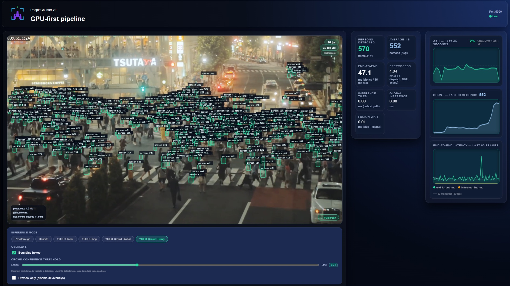

# PeopleCounter



Real-time AI crowd counting on a 4K camera stream. Multiple inference modes
(object detection, tiling, density estimation) run entirely inside a Docker
container on an NVIDIA GPU. A web UI served by the container lets you switch
modes live, watch overlays on the video feed, and monitor GPU utilisation,
person count, and end-to-end latency.

The current codebase is `app_v2/` — a TensorRT-only, GPU-first orchestrator.
The legacy pipeline lives under `app_v1/` for reference.

---

## Hardware Requirements

`app_v2` was developed and tested on:

| Component | Tested configuration |
|-----------|---------------------|
| GPU | **NVIDIA RTX 5060 Ti** (Blackwell sm_120, 16 GB GDDR7, 448 GB/s) |
| CUDA | 13.1 |
| TensorRT | 10.15.1 |
| OS (host) | Ubuntu 24.04 (bare metal or WSL2) |

**RTX 5000 series (Blackwell)** — recommended. All FP8-QDQ TensorRT engines and
model conversions have been optimised for the Blackwell architecture.

**RTX 4000 series (Ada Lovelace)** — should work; FP8 is supported, but the
engines must be recompiled locally (TensorRT engines are hardware-specific).
Real-world performance on Ada has not been measured.

**OpenVINO / Intel GPU / NPU** — not supported in `app_v2`. WSL2 and Docker do
not expose Intel accelerators. OpenVINO integration was part of `app_v1`, which
ran natively on Windows and leveraged Intel NPU/GPU via the OpenVINO runtime.
The conversion script (`convert_pth_to_openvino.py`) is preserved for `app_v1`
reference only.

---

## Inference Modes

| Mode | Model | Precision | Output |
|------|-------|-----------|--------|
| `passthrough` | — | — | raw video |
| `yolo_global` | yolo26x (decoder: YOLOv8) | FP8-QDQ | bbox + seg masks |
| `yolo_tiles` | yolo26n (decoder: YOLOv8) | FP8-QDQ | bbox (3×2 tiles) |
| `density` | DM-Count QNRF (VGG16) | FP16 | density heatmap |
| `crowd_global` | YOLO-CROWD (YOLOv5) | FP16 | bbox |
| `crowd_tiles` | YOLO-CROWD (YOLOv5) | FP16 | bbox (3×2 tiles) |

> **Model naming note**: The inference models are **yolo26** (YOLO v26 family).
> "YOLOv8" refers to the TensorRT decoder engine format — the decoding logic
> is compatible with YOLOv8, YOLO11, and yolo26 output tensors. The models
> themselves are yolo26n/s/m/l/x.

---

## Quick Start

### Prerequisites — Linux / WSL2 (Ubuntu 24.04)

`app_v2` runs inside Docker. Clone and run on a machine with:
- Ubuntu 24.04 (native or WSL2)
- NVIDIA GPU with drivers that expose CUDA inside WSL/containers
- Docker Engine + NVIDIA Container Toolkit

> **Windows users**: `app_v2` is **not** run directly on Windows. Clone under
> WSL2 (Ubuntu 24.04) to build and run the Docker container. The Windows
> `windows/` sub-directory contains a separate **video streaming tool** — see
> the [Windows Video Streamer](#windows-video-streamer) section.

### 1. Clone (Linux / WSL2)

```bash
git clone <repo-url> PeopleCounter
cd PeopleCounter
```

### 2. Build the Docker image

Run once. Takes ~30–60 minutes (downloads CUDA base image, builds OpenCV from source).

```bash
./0_build_image.sh
```

This produces `people-counter:gpu-final`.

### 3. Install the runtime toolchain layer

Installs TensorRT 10.15, Python packages, NVIDIA ModelOpt, and CUDA bindings
on top of the base image. Takes ~5–10 minutes.

```bash
./1_prepare.sh
```

### 4. Build the NVDEC layer (required for app_v2)

Compiles PyNvCodec / VPF from source and commits a new image layer.
NVDEC hardware video decode is required by the `app_v2` orchestrator.

```bash
./2_prepare_nvdec.sh
```

Produces `people-counter:gpu-final-nvdec`.

> The installer looks for `external/Video_Codec_SDK_13.0.37` inside the repo.
> If absent it downloads the archive from NVIDIA's servers (sign-in may be
> required). Set `VIDEO_CODEC_SDK_DIR=/path/to/sdk` to use a local copy.

### 5. (Optional) Build TensorRT engines

Pre-built `*.engine` files for RTX 5060 Ti are included in `models/tensorrt/`.
Run this step only when you need to regenerate them (e.g. on a different GPU
or after a TensorRT version change):

```bash
./3_prepare_models.sh
```

To rebuild individual model families:

```bash
# All YOLO26 variants (FP32 + FP16 + FP8-QDQ):
./3_prepare_models.sh

# FP16 only (skip FP8):
SKIP_FP8=1 ./3_prepare_models.sh

# FP8 only (skip FP16):
SKIP_FP16=1 ./3_prepare_models.sh

# Specific seg models only:
SEG_MODELS="yolo26x-seg" ./3_prepare_models.sh

# Specific bbox models only (yolo_tiles):
BBOX_MODELS="yolo26n" SKIP_FP16=1 ./3_prepare_models.sh

# Skip density model rebuild:
SKIP_DENSITY=1 ./3_prepare_models.sh
```

For density model ONNX export and TensorRT conversion, see
`export_density_to_onnx.py` and `convert_onnx_to_trt.py`.

### 6. Run the application

```bash
./4_run_app.sh 'http://<windows-ip>:5002/video_feed' --app-version v2
```

Then open **http://localhost:5000** in your browser.

Other source examples:

```bash
# Local USB camera:
./4_run_app.sh /dev/video0 --app-version v2

# RTSP stream:
./4_run_app.sh 'rtsp://192.168.1.100:554/stream' --app-version v2

# Pass extra environment variables:
./4_run_app.sh 'http://...' --app-version v2 -e PERF_LOG=1

# CUDA profiling (nsys):
./4_run_app.sh 'http://...' --app-version v2 --cuda-profile
```

### 7. Run tests

```bash
./5_run_tests.sh
```

Runs 199 unit and integration tests inside `people-counter:gpu-final-nvdec`.
Expected output: `199 passed, 1 skipped`.

---

## Windows Video Streamer

The `windows/` directory contains a standalone streaming tool that runs on
Windows and exposes any camera, image, or video file as an HTTP stream
consumable by the Docker container.

**Technology**: Python + FFmpeg (auto-downloaded on first run). Does **not**
require CUDA or Docker on the Windows machine.

### Setup and launch (interactive)

Double-click `windows/setup_and_run.bat`, or run it from a terminal:

```bat
windows\setup_and_run.bat
```

On first run it:
1. Creates a `venv_bridge` Python virtual environment
2. Installs dependencies (Flask, OpenCV)
3. Auto-downloads FFmpeg if not found in `windows/bin/`
4. Asks you to choose a webcam, resolution, and H.264 encoder
5. Starts streaming on `http://<your-ip>:5002/video_feed`

### Streaming a reference image or video file

Use `windows/setup_and_run_ref_image.bat` (pre-configured for 4K@30fps via
Intel QSV encoder):

```bat
windows\setup_and_run_ref_image.bat
```

Or pass arguments directly to `camera_bridge.py`:

```bat
# Stream an image (looped endlessly):
venv_bridge\Scripts\python.exe windows\camera_bridge.py ^
    --input-file "windows\ref_images\people_walking.jpg" ^
    --resolution 4K ^
    --fps 30 ^
    --bitrate 20000 ^
    --encoder h264_qsv

# Stream a video file (looped):
venv_bridge\Scripts\python.exe windows\camera_bridge.py ^
    --input-file "C:\Videos\crowd.mp4" ^
    --fps 25

# Specify a port:
venv_bridge\Scripts\python.exe windows\camera_bridge.py --port 5003
```

### camera_bridge.py arguments

| Argument | Default | Description |
|----------|---------|-------------|
| `--input-file PATH` | — | Image (`.jpg`/`.png`) or video file to stream; looped endlessly. Omit to use a webcam. |
| `--resolution` | source | Output resolution: `1080p`, `4K`, etc. Scales/letterboxes the source. |
| `--fps N` | 30 | Output framerate (images or video cap). |
| `--bitrate KBPS` | auto | Target bitrate in kbps (encoder-dependent if omitted). |
| `--encoder ENC` | auto | H.264 encoder: `h264_nvenc` (NVENC), `h264_qsv` (Intel QSV), `libx264` (CPU). Auto-detected from available hardware. |
| `--port N` | 5002 | HTTP listen port. |

The stream URL to pass to `4_run_app.sh` is `http://<windows-ip>:<port>/video_feed`.

---

## Configuration (YAML)

`app_v2` is configured via YAML files — not `.env` profiles. Key files:

| File | Contents |
|------|----------|
| `app_v2/config/pipeline.yaml` | Fusion strategy, CUDA stream IDs, tile groups, tensor pool, enabled models |
| `app_v2/config/model_inference.yaml` | Per-mode confidence thresholds, NMS IoU, density peak weight |
| `app_v2/config/test_config.yaml` | Test harness settings (stream URL, timeouts) |

See [app_v2/docs/README_ARCHI.md](app_v2/docs/README_ARCHI.md) for a full description of every configuration key.

---

## Important Model Notes

- **Model family**: `yolo26` (not YOLOv8). The decoder is named `yolo_v8_decoder`
  because it handles the YOLOv8-compatible output tensor format, which is also
  produced by yolo26 and YOLO11 models.
- **TensorRT engines are hardware-specific**: the `.engine` files included in
  this repo were compiled for RTX 5060 Ti (sm_120, CUDA 13.1, TRT 10.15).
  Running them on a different GPU requires recompiling with `./3_prepare_models.sh`.
- **Opset 18**: ONNX exports target Opset 18 so that Ultralytics stays
  compatible with TensorRT conversion.
- **OpenVINO IR**: artifacts in `models/openvino/` are for `app_v1` only.
  `app_v2` does not use OpenVINO.

---

## Performance Optimization

**FP8-QDQ (production standard)**: All YOLO26 TensorRT engines use FP8 with
quantize-dequantize (Q/DQ) nodes inserted by NVIDIA ModelOpt. This is the
recommended precision for Blackwell GPUs, which have dedicated FP8 Tensor Core
acceleration.

**INT8 quantization**: On paper, INT8 promises a 2–4× speedup over FP16.
In practice, on RTX 5000 Blackwell GPUs optimised for FP8, INT8 calibration
showed no significant advantage over FP8-QDQ. Gains were only marginally visible
on larger models (yolo26m/l/x) and essentially absent on yolo26n. FP8-QDQ
via ModelOpt is the correct path for this hardware.

**Production numbers (FP8-QDQ engines)**:

| Mode | Model | Input | Latency |
|------|-------|-------|--------:|
| `yolo_global` | yolo26x FP8-QDQ | 640×640 | ~3–5 ms |
| `yolo_tiles` | yolo26n FP8-QDQ | 6 × 640×640 | ~10–15 ms |
| `density` | DM-Count QNRF FP16 | 1920×1088 | 22.9 ms |
| `crowd_global` | YOLO-CROWD FP16 | 640×640 | ~6–10 ms |
| `crowd_tiles` | YOLO-CROWD FP16 | 6 × 640×640 | ~20–30 ms |

See [app_v2/docs/README_PERFORMANCE_ANALYSIS.md](app_v2/docs/README_PERFORMANCE_ANALYSIS.md) for the full benchmark, latency budget, and metric reference.

---

## See also

- [README_DOCKER.md](README_DOCKER.md) — Docker build steps, prerequisites, and GPU validation.
- [app_v2/docs/README_ARCHI.md](app_v2/docs/README_ARCHI.md) — Full v2 architecture: data flow, video streams, inference modes, CUDA stream assignment, API surface.
- [app_v2/docs/README_PERFORMANCE_ANALYSIS.md](app_v2/docs/README_PERFORMANCE_ANALYSIS.md) — Benchmark numbers, latency budget, metric key reference.
- [app_v2/docs/README_PREPROCESS.md](app_v2/docs/README_PREPROCESS.md) — GPU preprocessing pipeline, GpuTensorPool, kernel routing.
- [app_v2/docs/MAKER_FAIRE.md](app_v2/docs/MAKER_FAIRE.md) — Exhibition panels explaining the system at macro/micro level.
- [DENSITY_PERFORMANCE.md](DENSITY_PERFORMANCE.md) — DM-Count QNRF full benchmark: all configurations, pixel-budget law, preprocessing strategies.
- [PERFORMANCE_OPTIMIZATION.md](PERFORMANCE_OPTIMIZATION.md) — YOLO FP8-QDQ optimization guide, parallel tile split analysis.

---

## Credits & Licenses

### LWCC — Lightweight Crowd Counting

Used for DM-Count, CSRNet, Bayesian crowd counting, and SFANet models.

> This library is a result of research by **Matija Teršek** and **Maša Kljun**.
> Although the paper has not been published yet, please provide the link to the
> GitHub repository if you use LWCC in your research.
> Repository: <https://github.com/tersekmatija/lwcc>
> License: [MIT](https://github.com/tersekmatija/lwcc/blob/master/LICENSE)
> (model licenses — CSRNet, Bayesian, DM-Count, SFANet — are inherited from
> their respective upstream repositories)

### YOLO-CROWD

Used for crowd-optimised bounding box detection (`crowd_global`, `crowd_tiles`).

> Repository: <https://github.com/zaki1003/YOLO-CROWD>
> License: MIT
> References: [YOLOv5](https://github.com/ultralytics/yolov5) ·
> [yolov5-face](https://github.com/deepcam-cn/yolov5-face) ·
> [mmdetection](https://github.com/open-mmlab/mmdetection) ·
> [repulsion_loss_pytorch](https://github.com/dongdonghy/repulsion_loss_pytorch)

### Ultralytics (YOLOv8 decoder / yolo26 architecture)

> Repository: <https://github.com/ultralytics/ultralytics>
> License: **AGPL-3.0** for open-source use.
> For commercial deployment, an Ultralytics Enterprise License is required —
> see <https://www.ultralytics.com/license>.
