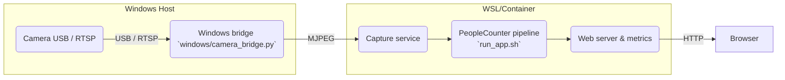
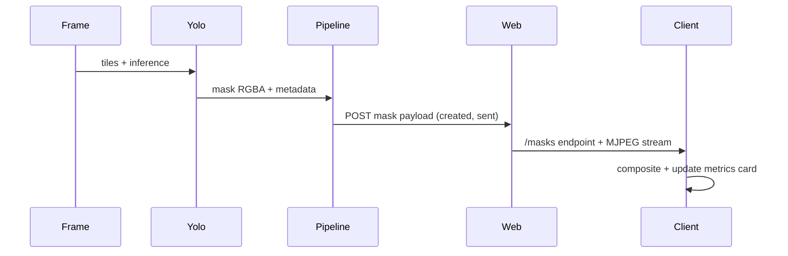

# Architecture & Data Flow

Ce document décrit la séparation hôte/pipeline, la création des masques, la télémétrie, et les flux de densité. Le guide complète [README.md](README.md) et la doc Docker, et clarifie les `.env` utilisés pour piloter les backend.

## 1. Vue globale du système



- Le bridge Windows installe Flask/OpenCV, expose `http://<IP>:5002/video_feed`, puis `run_app.sh` dans WSL consomme ce flux.
- `run_app.sh` source `scripts/configs/<profil>.env` avant de démarrer `camera_app_pipeline.py` et les moteurs `YoloSegPeopleCounter`, `PeopleCounterProcessor`, `LWCC`.
- L’interface Web récupère ensuite le flux MJPEG (caméras sans masque) et une requête distincte pour les masques, puis compose les deux sur le canvas adaptable.

## 2. Pipeline d’inférence, masques et métriques

```mermaid
flowchart TB
   frame[Frame reçue]
   preprocess[Pré-processing 4K/1080p]
   yolo[YOLO segmentation / densité]
   mask[Masque RGBA downscalé]
   encode[Encode mask (base64, metadata)]
   push[Payload MQTT/HTTP]
   metrics[Metrics card & logs]
   ui[Web client (canvas)]

   frame --> preprocess --> yolo --> mask --> encode --> push --> ui
   push --> metrics
   metrics --> ui
```

- `YoloSegPeopleCounter` génère `created_at` + `created_at_ts` pour chaque masque, puis `_encode_mask_blob` ajoute la taille/offset nécessaire pour que le client aligne correctement le rendu.
- `camera_app_pipeline.py` agrège les métriques (`yolo_mask_payload_*`) et affiche `[MASK TIMING]` avec les durées création/envoi.
- `static/js/app.js` recalcule l’intervalle de polling en fonction du FPS YOLO et affiche la carte « mask timings » (création/envoi/affichage/total).
- La fusion des masques se fait côté client : le serveur fournit une image MJPEG (sans masque) et un POST séparé pour le masque – le navigateur applique un canvas alpha-only pour colorer uniquement les zones détectées.

## 3. Séquence des masques et télémétrie



- Chaque POST contient `created_at`, `created_at_ts`, et `payload_sent_at`. Le client montre ces timestamps côté UI et déclenche un rafraîchissement adaptatif via `setTimeout(adaptiveInterval)`.
- Cette séquence découple la fréquence du MJPEG (quasi-fixe) de celle des masques (adaptative), d’où la perception d’un overlay à ~1 Hz même quand YOLO tourne plus vite.

## 4. Tunnel de densité

```mermaid
flowchart LR
   sensor[Capture 4K]
   tile[Tiling CPU (global + 2x2)]
   processor[PeopleCounterProcessor]
   lwcc[LWCC / Density model]
   integration[Fusion & drawing]

   sensor --> tile --> processor --> lwcc --> integration
```

- `PeopleCounterProcessor` envoie des tiles 640×640 (global + locaux) vers TensorRT/OpenVINO, puis recompose une carte dense 540p pour la fréquence de mise à jour.
- Les flags `YOLO_USE_GPU_PREPROC` et `YOLO_USE_GPU_POST` déplacent la mise à l’échelle and la fusion d’un CPU `cv2.resize` vers des kernels CUDA ou du rendu GPU, ce qui réduit les 195 ms courants sur les pipelines CP intense.
- `DENSITY_THRESHOLD`, `DENSITY_TILING`, et `YOLO_TILING` se pilotent depuis les `.env`, permettant de choisir l’équilibre entre précision et débit.

## 5. `.env`, profils et variables clés

- Chaque profil `.env` (stocké dans `scripts/configs`) exporte les variables nécessaires avant de lancer l’application. Exemple :

```bash
export YOLO_BACKEND=tensorrt_native
export YOLO_MODEL=yolo26s-seg.engine
export YOLO_USE_GPU_PREPROC=1
export YOLO_USE_GPU_POST=1
export YOLO_PIPELINE_MODE=gpu_full
export LWCC_BACKEND=tensorrt
export DENSITY_TILING=1
export DENSITY_THRESHOLD=15
```

- `run_app.sh --profile <profil>` remplace les anciens arguments positionnels et automatise le sourcing du `.env` suivi de `camera_app_pipeline.py`. Vous pouvez aussi définir `CAMERA_URL` ou `MQTT_*` avant d’exécuter le script.

## 6. Documentation & plans associés

- Ce guide complète [README.md](README.md) pour le quick start et [README_DOCKER.md](README_DOCKER.md) pour l’image containerisée.
- Les plans suivants tracent l’évolution de la superposition, des métriques et de la documentation :
  - [plans/documentation-refresh-plan.md](plans/documentation-refresh-plan.md)
  - [plans/mask_overlay_roadmap.md](plans/mask_overlay_roadmap.md)
  - [plans/mask_timing-plan.md](plans/mask_timing-plan.md)

- La pile masques/logs sera enrichie d’un plan de performance dédié pendant la Phase 3 pour les graphes de latence et le nettoyage des logs.