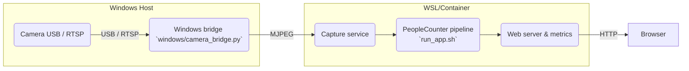
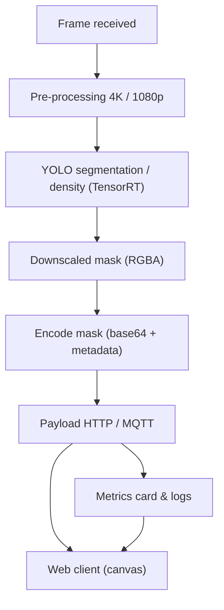
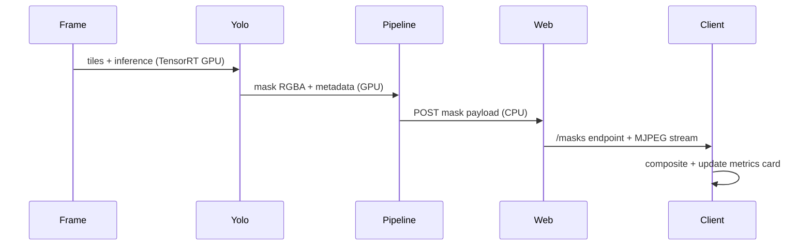
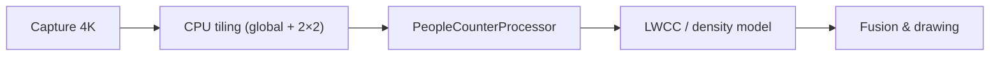

# Architecture & Data Flow

Ce document décrit la séparation hôte/pipeline, la création des masques, la télémétrie, et les flux de densité. Le guide complète [README.md](README.md) et la doc Docker, et clarifie les `.env` utilisés pour piloter les backend.

## 1. Vue globale du système



- Le bridge Windows installe Flask/OpenCV, expose `http://<IP>:5002/video_feed`, puis `run_app.sh` dans WSL consomme ce flux.
- `run_app.sh` source `scripts/configs/<profil>.env` avant de démarrer `camera_app_pipeline.py` et les moteurs `YoloSegPeopleCounter`, `PeopleCounterProcessor`, `LWCC`.
- L’interface Web récupère ensuite le flux MJPEG (caméras sans masque) et une requête distincte pour les masques, puis compose les deux sur le canvas adaptable.

## 2. Pipeline d’inférence, masques et métriques



- `YoloSegPeopleCounter` stamps `created_at`/`created_at_ts` for each mask and `_encode_mask_blob` inserts the geometry/offset data so the client aligns the overlay.
- `camera_app_pipeline.py` collects the `yolo_mask_payload_*` fields, publishes `[MASK TIMING]` logs, and ships the payload to the web server.
- `static/js.app.js` adapts its polling interval to the YOLO FPS reports and renders the “mask timings” card (creation, send, display) for instant feedback.
- The browser pulls the MJPEG video stream separately from the mask POST, so masks are composited with an `alpha` canvas without touching the base feed.

## 3. Mask & telemetry sequence



- Each POST contains `created_at`, `created_at_ts`, and `payload_sent_at`. The client formats these timestamps on the UI and triggers an adaptive refresh via `setTimeout(adaptiveInterval)`.
- GPU vs CPU: TensorRT (YOLO) draws the masks while the CPU encodes the payload, publishes the metrics/logs, and the browser composites the canvas.
- This sequence separates the MJPEG frequency (steady) from the adaptive mask updates, highlighting why the overlay used to appear locked to the slower mask cycle until adaptive polling arrived.

## 4. Tunnel de densité



- `PeopleCounterProcessor` sends `640×640` tiles (global + locals) to TensorRT/OpenVINO and reassembles a 540p density map.
- `YOLO_USE_GPU_PREPROC` / `YOLO_USE_GPU_POST` shift resizing and mask fusion from CPU `cv2` calls to CUDA kernels, trimming the ~195 ms batches off the slow path.
- `DENSITY_THRESHOLD`, `DENSITY_TILING`, and `YOLO_TILING` remain `.env`-driven knobs for balancing precision and throughput.

## 5. `.env` profiles and key variables

- Each profile `.env` file under `scripts/configs` exports the variables that the entry script needs. Example:

```bash
export YOLO_BACKEND=tensorrt_native
export YOLO_MODEL=yolo26s-seg.engine
export YOLO_USE_GPU_PREPROC=1
export YOLO_USE_GPU_POST=1
export YOLO_PIPELINE_MODE=gpu_full
export LWCC_BACKEND=tensorrt
export DENSITY_TILING=1
export DENSITY_THRESHOLD=15
```

- `run_app.sh --profile <profile>` replaces the old positional arguments by sourcing the `.env` file before executing `camera_app_pipeline.py`. You can still override `CAMERA_URL` or `MQTT_*` variables before starting the script.

## 6. Documentation & associated plans

- This guide complements [README.md](README.md) for the quick start path and [README_DOCKER.md](README_DOCKER.md) for the container image.
- Track the masking/metrics/documentation updates via:
   - [plans/documentation-refresh-plan.md](plans/documentation-refresh-plan.md)
   - [plans/mask_overlay_roadmap.md](plans/mask_overlay_roadmap.md)
   - [plans/mask_timing-plan.md](plans/mask_timing-plan.md)
- A dedicated [plans/performance-latency-plan.md](plans/performance-latency-plan.md) now ties the latency graph, log cleanup, and 25–30 fps target into the observable flows so the UI cards reflect measurable goals.