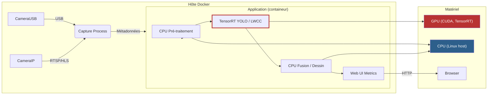
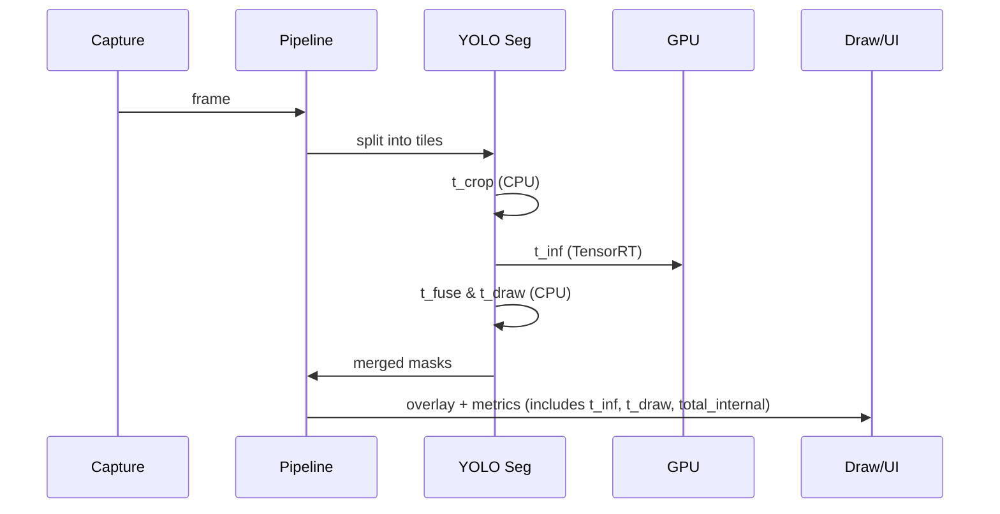

# Docker : Build et Exécution GPU (Ubuntu 24.04 + CUDA 13.1)

Ce dépôt contient un `Dockerfile` multi-stage optimisé pour construire une image performante incluant **OpenCV 4.13.0 (CUDA)**, **PyTorch 2.9.1**, et **TensorRT 10.14**.

## 🏗️ Procédure de Build

Le build est optimisé via un système multi-stage (OpenCV -> Dépendances -> Runtime).

```bash
# Lancer le build (inclut la gestion du cache et le backup automatique)
./build_image.sh
```

### 🔍 Vérification du build
Une fois l'image créée, vérifiez que le GPU est bien accessible :
```bash
docker run --rm --gpus all people-counter:gpu-final python3 -c "import cv2; import torch; print('OpenCV CUDA:', cv2.cuda.getCudaEnabledDeviceCount()); print('PyTorch CUDA:', torch.cuda.is_available())"
```

## 🧱 Architecture CPU / GPU


## 🎞️ Flux vidéo par tuiles


## 🚀 Exécution de l'application

Utilisez le script d'exécution qui gère automatiquement les accès GPU, caméras et ports réseaux.

```bash
# Lancer l'application (utilise /dev/video0 par défaut)
./run_app.sh

# Pour utiliser un autre périphérique caméra
./run_app.sh /dev/video1
```

---

## 📸 Caméra USB sur WSL2 (Windows)

Puisque le noyau WSL2 par défaut ne supporte pas les caméras USB nativement (pas de `/dev/video*`), nous utilisons un **Bridge Vidéo** pour envoyer le flux de Windows vers Docker.

### 1. Sur Windows (Préparation)
Lancez le script de bridge sur votre machine hôte :
1. Installez les requis : `pip install flask opencv-python`.
2. Lancez le script : `python windows/camera_bridge.py`.
   *Ce script crée un flux MJPEG sur le port 5002 de Windows.*

### 2. Trouver votre IP Windows
Dans un terminal Windows (PowerShell/CMD), tapez `ipconfig`. Cherchez l'IP de votre carte WiFi ou Ethernet (ex: `192.168.1.15`).

### 3. Lancer l'application dans WSL
```bash
# Remplacez <IP> par votre adresse IP Windows
./run_app.sh http://<IP>:5002/video_feed
```

Une fois lancé, ouvrez votre navigateur sur `http://localhost:5000` pour voir les résultats.

---

## 🛠️ Ancienne méthode (Native usbipd)
*Uniquement si vous avez compilé votre propre noyau WSL avec support UVC.*
"### 2. Sous WSL (Linux) - Résolution de problèmes"
Si `ls /dev/video*` ne renvoie rien après l'attachement, c'est que votre noyau WSL (Kernel) manque de drivers UVC.

**Solution 1 (Recommandée) :**
Dans un PowerShell Windows (Admin) :
```powershell
wsl --update
wsl --shutdown
```
Relancez ensuite WSL. Les noyaux récents (6.6+) supportent souvent les caméras par défaut.

**Solution 2 (Secours) : Bridge Réseau**
Si le driver bloque toujours, utilisez le script `windows_camera_bridge.py` fourni :
1. Sur **Windows** : `pip install flask opencv-python`
2. Sur **Windows** : `python windows_camera_bridge.py`
3. Sur **WSL** : `./run_app.sh http://<IP_VOTRE_PC>:5002/video_feed`

### 3. Lancer l'application
Une fois la caméra détectée :

---

## 📂 Gestion des fichiers et GitHub

### Fichiers obsolètes (à supprimer)
Les fichiers suivants sont des reliquats d'anciennes versions et ne sont plus nécessaires avec le nouveau `Dockerfile` :
- `Dockerfile.probe` : Test temporaire.
- `setup.sh`, `run_docker.sh`, `setup_docker.sh` : Remplacés par le workflow Docker standard.
- `make_wheelhouse.sh` (racine) : Utilisez `scripts/make_wheelhouse.sh`.

### Que faut-il commiter ?
- **OUI** : `Dockerfile`, `requirements.cuda.txt`, `scripts/make_wheelhouse.sh`.
- **NON** : Le dossier `wheelhouse/` (trop lourd, contient des binaires `.whl` qui sont téléchargés dynamiquement durant le build Docker via le cache).
- **NON** : Les dossiers `models/` (doivent être gérés via un script de téléchargement ou stockés séparément).

### Structure des modèles
Le dossier `models/` est monté depuis l’hôte et doit conserver cette arborescence claire :

| Sous-répertoire | Contenu attendu |
|-----------------|-----------------|
| `models/pt/` | Poids YOLO originaux en `.pt` téléchargés via `prepare_models.py` ou `YOLO_PREPARE`, utilisés par `export_yolos_to_trt.py`. |
| `models/onnx/` | Faisceaux `.onnx` générés pour tous les modèles (YOLO et densité). Les scripts déplacent les exports Achim du cache Ultralytics vers ce dossier. |
| `models/tensorrt/` | Moteurs TensorRT `.engine` compilés pour YOLO (batch 32) et LWCC (batch 8). Conversion pilotée par `convert_onnx_to_trt.py`. |
| `models/openvino/` | IR OpenVINO (`.xml` + `.bin`) produits par `convert_pth_to_openvino.py`. |
| `models/lwcc_weights/` | Pths LWCC persistants. `LWCC_WEIGHTS_PATH` pointe vers ce dossier, donc les téléchargements n’atterrissent plus dans `/.lwcc/weights`. |

Les scripts `prepare_models.py`, `download_lwcc_weights.py` et `export_yolos_to_trt.py` font maintenant en sorte de créer ces dossiers avec des permissions 775, d’exécuter les conversions à partir de la racine du dépôt, puis de nettoyer les sous-arborescences temporaires (`models/models/`). Il suffit de relancer `./run_app.sh` (ou `python3 prepare_models.py`) après toute mise à jour pour regénérer les poids aux bons emplacements.

```