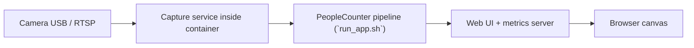
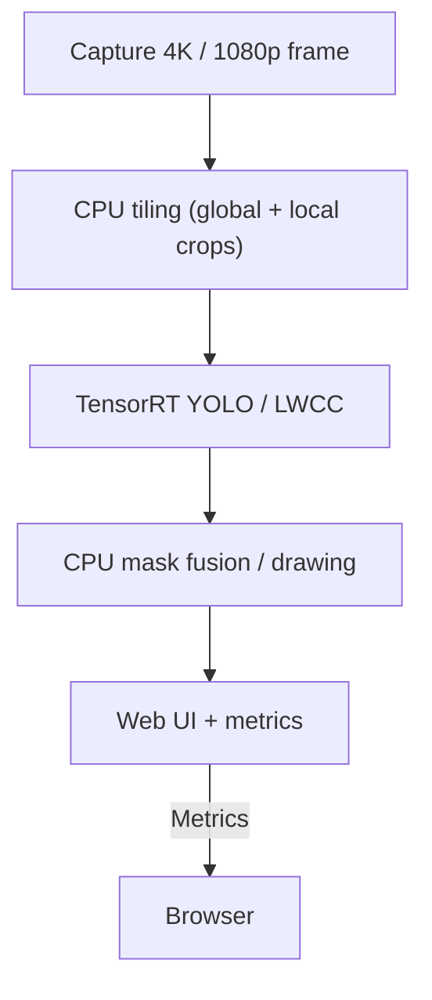

# Docker: Build and GPU Runtime (Ubuntu 24.04 + CUDA 13.1)

This repository ships a multi-stage `Dockerfile` that bundles **OpenCV 4.13.0 with CUDA**, **PyTorch 2.9.1**, and **TensorRT 10.14** so the PeopleCounter stack can run headless inside WSL/containers.

## Build procedure

1. Build the image:

```bash
./build_image.sh
```

2. Verify the GPU is available inside the container:

```bash
docker run --rm --gpus all people-counter:gpu-final python3 -c "import torch, cv2; print('PyTorch CUDA:', torch.cuda.is_available()); print('OpenCV CUDA devices:', cv2.cuda.getCudaEnabledDeviceCount())"
```

3. Run the GPU test harness after you rebuild the NVDEC layer with `./2_prepare_nvdec.sh` so the tests execute inside `people-counter:gpu-final-nvdec`:

```bash
./5_run_tests.sh
```

It compiles `app_v2` with `python -m compileall` and executes `pytest app_v2/tests` inside the NVDEC-ready `people-counter:gpu-final-nvdec` image so the orchestrator is validated on the same GPU stack used in production.

4. Prerequisites inside WSL:

- Docker Desktop/Engine installed inside the subsystem.
- NVIDIA Container Toolkit (`nvidia-container-toolkit`) so GPUs are exposed to containers.
- Working `nvidia-smi` output from inside WSL (requires NVIDIA drivers that expose CUDA in the subsystem).

## Architecture overview

This guide stays Docker-focused; the full architectural story (Windows → WSL bridge, mask polling, latency metrics) lives in [README_ARCHITECTURE.md](README_ARCHITECTURE.md) with updated mermaid diagrams.



## Tile-based video flow



The GPU handles TensorRT inference and, when enabled via `.env`, the GPU pre/post kernels for resizing and mask rendering. The CPU currently performs tiling, mask blending, and metrics aggregation.

## Tiling, preprocessing, and optimization

- `YOLO_USE_GPU_PREPROC=1` pushes cropping/resizing into CUDA kernels so the CPU isn’t blocked copying tiles in/out of GPU memory.
- `YOLO_USE_GPU_POST=1` keeps the mask fusion on the GPU, avoiding a redundant `cv2` blend pass on the host.
- The `YOLO_PIPELINE_MODE` flag (`auto`, `gpu`, `gpu_full`, `cpu`) lets you force the full CUDA chain or fall back to CPU-only behavior.
- Most Qt tiles are sized at `640×640` in 4K mode; the container batches them through TensorRT to fill the GPU with work without overwhelming VRAM.

## Profiles & `.env`

`run_app.sh` sources `scripts/configs/<profile>.env` before launching the `camera_app_pipeline.py`. Each profile exposes:

- YOLO settings (`YOLO_BACKEND`, `YOLO_MODEL`, `YOLO_DEVICE`, `YOLO_USE_GPU_*`, `YOLO_PIPELINE_MODE`).
- Density settings (`LWCC_BACKEND`, `DENSITY_TILING`, `DENSITY_THRESHOLD`, `LWCC_THRESHOLD`).
- Debug logging flags (`DEBUG_TILING`, `EXTREME_DEBUG`) and MQTT overrides.

See [README_PARAMETERS.md](README_PARAMETERS.md) for the effect of every flag and [README_ARCHITECTURE.md](README_ARCHITECTURE.md) for the full flow across containers and the web client.

## Documentation and alignment

- Architecture, masking, and latency dashboards: [README_ARCHITECTURE.md](README_ARCHITECTURE.md).
- Track documentation updates + masking/timing progress in `plans/documentation-refresh-plan.md`, `plans/mask_overlay_roadmap.md`, and `plans/mask_timing-plan.md`.
- Phase 3 will add a dedicated performance/latency plan to keep the dashboards, logs, and documentation synchronized.
