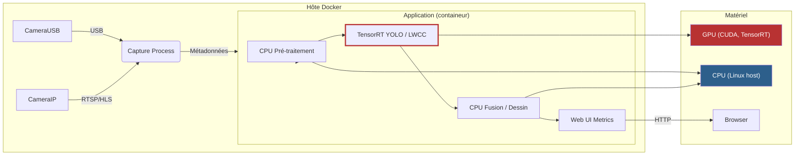
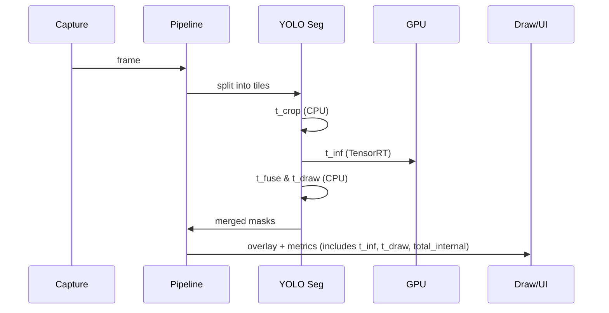
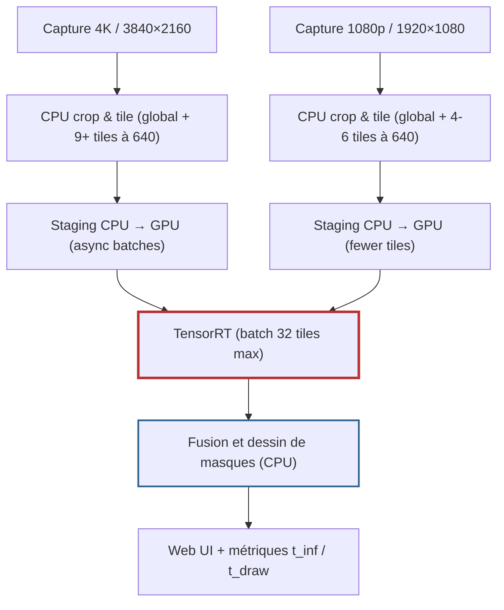

# Docker : Build et Exécution GPU (Ubuntu 24.04 + CUDA 13.1)

Ce dépôt contient un `Dockerfile` multi-stage optimisé pour construire une image performante incluant **OpenCV 4.13.0 (CUDA)**, **PyTorch 2.9.1**, et **TensorRT 10.14**.

## 🏗️ Procédure de Build

Le build est optimisé via un système multi-stage (OpenCV -> Dépendances -> Runtime).

```bash
# Lancer le build (inclut la gestion du cache et le backup automatique)
./build_image.sh
```

### 🔍 Vérification du build
Une fois l'image créée, vérifiez que le GPU est bien accessible :
```bash
docker run --rm --gpus all people-counter:gpu-final python3 -c "import cv2; import torch; print('OpenCV CUDA:', cv2.cuda.getCudaEnabledDeviceCount()); print('PyTorch CUDA:', torch.cuda.is_available())"
```

## 🧱 Architecture CPU / GPU


## 🎞️ Flux vidéo par tuiles


## 🧱 Tiling + pré/post-traitement (4K vs 1080p)

La version 4K découpe les 3840×2160 pixels en un *global tile* 640×640 (pour conserver la vue d'ensemble) et en une grille d'îlots 640×640 répartis sur la scène (8 à 12 tiles selon le niveau de zoom). Le *global tile* sert deux objectifs clés : il fournit une vue native pour la fusion finale (les masques des sous-tiles sont recollés sur ce canevas global) et il agit de référence pour déterminer les offsets/scales des tiles locales. En 1080p, la grille reste plus compacte (4-6 tiles) mais le pattern est identique.

Chaque tile (global ou local) est copiée en mémoire CPU, ses métadonnées (position/échelle) sont stockées, puis la séquence est envoyée au moteur TensorRT pour être traitée. Les 45 ms du GPU représentent la somme des inférences sur toutes les tiles locales + le global tile, pas un « passage 4K » en un seul batch. Dans l’implémentation actuelle, le recadrage, la mise à l’échelle et la reconstruction des masques se font sur CPU, ce qui explique les 195 ms de bout en bout.

Pour optimiser, il faut déplacer le plus de ces étapes sur CUDA : activer `YOLO_USE_GPU_PREPROC=1` permet de travailler sur des buffers GPU avec un pipeline de kernels (resize, crop, copy) et `YOLO_USE_GPU_POST=1` donne à TensorRT les moyens de dessiner les masques directement sur la texture globale. Un pipeline CUDA typique ici définirait des streams dédiés pour (1) charger l’image globale dans un buffer, (2) produire une version downscalée (global tile) et des crops pour chacun des tiles locaux, (3) lancer les inférences TensorRT en parallèle via un « batch » composé de ces tiles, et enfin (4) fusionner les résultats dans un buffer de sortie que la couche CPU/visu peut alpha-blender. Les streams CUDA permettent d’overlapper copie/inférence/post-processing pour éviter les goulets d’étranglement.

En complément, on peut brider les classes détectées sur l’index 0 (personne) pour éviter de diluer le moteur sur des catégories inutiles. La fusion des masques elle-même peut être déléguée à un fragment shader OpenGL ou CUDA (voir `YOLO_USE_GPU_POST=1` / un shader simple) pour faire le blend sur le canevas global sans repasser en CPU.



Le point d'optimisation principal est donc de réduire le temps passé sur le CPU : activer `YOLO_USE_GPU_PREPROC=1` et/ou `YOLO_USE_GPU_POST=1` permet de déporter la resize/crop et la fusion vers des kernels CUDA (en conjonction avec la version TensorRT native). D'autres pistes : groupement plus agressif des tiles dans des batches TensorRT plus larges, mise en pré-charge des copies via des streams CUDA dédiés, ou bien délégation de la fusion des masques à un fragment shader (OpenGL/CUDA) pour éviter les copies sur l'image finale.

## 🧰 Profils et fichiers `.env`

`run_app.sh` charge `scripts/configs/<profil>.env` pour injecter des `export KEY=VALUE` dans l'environnement Docker. Chaque fichier de profil définit notamment `YOLO_BACKEND`, `YOLO_MODEL`, `YOLO_DEVICE`, `DEBUG_TILING` et, depuis peu, les variables `YOLO_USE_GPU_PREPROC` / `YOLO_USE_GPU_POST` qui déclenchent les pipelines GPU. Pour les profils basés sur RTX (ex. `rtx_extreme.env`), ajoutez simplement :

```
export YOLO_USE_GPU_PREPROC=1
export YOLO_USE_GPU_POST=1
export YOLO_BACKEND=tensorrt_native
export YOLO_DEVICE=cuda
```

Le script supprime les commentaires, source le fichier, puis lance `docker run` avec les variables exportées ; il n’est donc pas nécessaire de déclarer ces exports ailleurs. Après modification, relancez `./run_app.sh --profile rtx_extreme` pour voir les changements. Vous pouvez vérifier les paramètres appliqués en démarrant un shell dans le conteneur (`./run_app.sh --profile rtx_extreme bash`) et en tapant `printenv | grep YOLO`.

Les variables `YOLO_USE_GPU_PREPROC` et `YOLO_USE_GPU_POST` respectent la même logique que les autres : toute valeur non vide active la version CUDA, et elles sont héritées par `camera_app_pipeline.py` à travers les modules `yolo_seg_people_counter.py` / `yolo_people_counter.py`. La carte « YOLO internal (ms) » dans l’interface Web affichera alors les temps d’inférence réels, y compris les gains éventuels si les kernels CUDA sont chargés.

## 🚀 Exécution de l'application

Utilisez le script d'exécution qui gère automatiquement les accès GPU, caméras et ports réseaux.

```bash
# Lancer l'application (utilise /dev/video0 par défaut)
./run_app.sh

# Pour utiliser un autre périphérique caméra
./run_app.sh /dev/video1
```

---

## 📸 Caméra USB sur WSL2 (Windows)

Puisque le noyau WSL2 par défaut ne supporte pas les caméras USB nativement (pas de `/dev/video*`), nous utilisons un **Bridge Vidéo** pour envoyer le flux de Windows vers Docker.

### 1. Sur Windows (Préparation)
Lancez le script de bridge sur votre machine hôte :
1. Installez les requis : `pip install flask opencv-python`.
2. Lancez le script : `python windows/camera_bridge.py`.
   *Ce script crée un flux MJPEG sur le port 5002 de Windows.*

### 2. Trouver votre IP Windows
Dans un terminal Windows (PowerShell/CMD), tapez `ipconfig`. Cherchez l'IP de votre carte WiFi ou Ethernet (ex: `192.168.1.15`).

### 3. Lancer l'application dans WSL
```bash
# Remplacez <IP> par votre adresse IP Windows
./run_app.sh http://<IP>:5002/video_feed
```

Une fois lancé, ouvrez votre navigateur sur `http://localhost:5000` pour voir les résultats.

---

## 🛠️ Ancienne méthode (Native usbipd)
*Uniquement si vous avez compilé votre propre noyau WSL avec support UVC.*
"### 2. Sous WSL (Linux) - Résolution de problèmes"
Si `ls /dev/video*` ne renvoie rien après l'attachement, c'est que votre noyau WSL (Kernel) manque de drivers UVC.

**Solution 1 (Recommandée) :**
Dans un PowerShell Windows (Admin) :
```powershell
wsl --update
wsl --shutdown
```
Relancez ensuite WSL. Les noyaux récents (6.6+) supportent souvent les caméras par défaut.

**Solution 2 (Secours) : Bridge Réseau**
Si le driver bloque toujours, utilisez le script `windows_camera_bridge.py` fourni :
1. Sur **Windows** : `pip install flask opencv-python`
2. Sur **Windows** : `python windows_camera_bridge.py`
3. Sur **WSL** : `./run_app.sh http://<IP_VOTRE_PC>:5002/video_feed`

### 3. Lancer l'application
Une fois la caméra détectée :

---

## 📂 Gestion des fichiers et GitHub
### Structure des modèles
Le dossier `models/` est monté depuis l’hôte et doit conserver cette arborescence claire :

| Sous-répertoire | Contenu attendu |
|-----------------|-----------------|
| `models/pt/` | Poids YOLO originaux en `.pt` téléchargés via `prepare_models.py` ou `YOLO_PREPARE`, utilisés par `export_yolos_to_trt.py`. |
| `models/onnx/` | Faisceaux `.onnx` générés pour tous les modèles (YOLO et densité). Les scripts déplacent les exports Achim du cache Ultralytics vers ce dossier. |
| `models/tensorrt/` | Moteurs TensorRT `.engine` compilés pour YOLO (batch 32) et LWCC (batch 8). Conversion pilotée par `convert_onnx_to_trt.py`. |
| `models/openvino/` | IR OpenVINO (`.xml` + `.bin`) produits par `convert_pth_to_openvino.py`. |
| `models/lwcc_weights/` | Pths LWCC persistants. `LWCC_WEIGHTS_PATH` pointe vers ce dossier, donc les téléchargements n’atterrissent plus dans `/.lwcc/weights`. |

Les scripts `prepare_models.py`, `download_lwcc_weights.py` et `export_yolos_to_trt.py` font maintenant en sorte de créer ces dossiers avec des permissions 775, d’exécuter les conversions à partir de la racine du dépôt, puis de nettoyer les sous-arborescences temporaires (`models/models/`). Il suffit de relancer `./run_app.sh` (ou `python3 prepare_models.py`) après toute mise à jour pour regénérer les poids aux bons emplacements.

