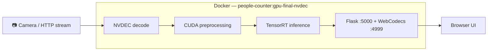

# Docker: Build and GPU Runtime

This repository ships a multi-stage `Dockerfile` that bundles **OpenCV 4.13.0
with CUDA**, **PyTorch 2.9.1**, and **TensorRT 10.15** so the PeopleCounter
stack can run headless inside WSL2 / Docker.

---

## Prerequisites (Ubuntu 24.04 / WSL2)

Install the following before running any `./N_prepare_*.sh` script.

### Docker Engine

```bash
sudo apt-get update
sudo apt-get install -y ca-certificates curl
sudo install -m 0755 -d /etc/apt/keyrings
sudo curl -fsSL https://download.docker.com/linux/ubuntu/gpg \
    -o /etc/apt/keyrings/docker.asc
sudo chmod a+r /etc/apt/keyrings/docker.asc
echo "deb [arch=$(dpkg --print-architecture) signed-by=/etc/apt/keyrings/docker.asc] \
    https://download.docker.com/linux/ubuntu \
    $(. /etc/os-release && echo "$VERSION_CODENAME") stable" | \
    sudo tee /etc/apt/sources.list.d/docker.list > /dev/null
sudo apt-get update
sudo apt-get install -y docker-ce docker-ce-cli containerd.io docker-buildx-plugin
sudo usermod -aG docker $USER   # log out/in for group change to take effect
```

### NVIDIA Container Toolkit

```bash
curl -fsSL https://nvidia.github.io/libnvidia-container/gpgkey | \
    sudo gpg --dearmor -o /usr/share/keyrings/nvidia-container-toolkit-keyring.gpg
curl -s -L https://nvidia.github.io/libnvidia-container/stable/deb/nvidia-container-toolkit.list | \
    sed 's#deb https://#deb [signed-by=/usr/share/keyrings/nvidia-container-toolkit-keyring.gpg] https://#g' | \
    sudo tee /etc/apt/sources.list.d/nvidia-container-toolkit.list
sudo apt-get update
sudo apt-get install -y nvidia-container-toolkit
sudo nvidia-ctk runtime configure --runtime=docker
sudo systemctl restart docker
```

### Verify GPU access inside WSL

```bash
nvidia-smi                        # should show your RTX GPU
docker run --rm --gpus all nvidia/cuda:12.0-base nvidia-smi
```

---

## Build Procedure

The build is split into four sequential scripts. Run them in order once.

### Step 0 — Base Docker image (~30–60 min, one-time)

```bash
./0_build_image.sh
```

Builds `people-counter:gpu-final` from the `Dockerfile`. Compiles OpenCV 4.13
with CUDA support from source — this is the slow step. Run it once; the image
is cached by Docker.

Verify:
```bash
docker run --rm --gpus all people-counter:gpu-final \
    python3 -c "import torch, cv2; print('PyTorch CUDA:', torch.cuda.is_available()); \
                print('OpenCV CUDA devices:', cv2.cuda.getCudaEnabledDeviceCount())"
```

### Step 1 — Runtime toolchain layer (~5–10 min)

```bash
./1_prepare.sh
```

Installs inside the running container and commits the result:
- TensorRT 10.15 runtime + Python bindings
- NVIDIA ModelOpt (FP8/INT8 quantization toolkit)
- ONNX GraphSurgeon, onnxconverter-common
- Python packages: `cuda-python`, `nvidia-ml-py`, Flask, pytest, psutil, …

### Step 2 — NVDEC / PyNvCodec layer (~10 min, required for app_v2)

```bash
./2_prepare_nvdec.sh
```

Compiles **VPF** (Video Processing Framework) and **PyNvCodec** from source,
enabling NVDEC hardware video decode. Commits the result as
`people-counter:gpu-final-nvdec`.

> The installer looks for `external/Video_Codec_SDK_13.0.37` in the repo.
> If absent it downloads from NVIDIA (sign-in may be required).
> Override with `VIDEO_CODEC_SDK_DIR=/path/to/sdk ./2_prepare_nvdec.sh`.

Verify:
```bash
./5_run_tests.sh    # 199 passed, 1 skipped
```

### Step 3 — AI model engines (optional, ~variable time)

```bash
./3_prepare_models.sh
```

Rebuilds TensorRT `.engine` files for all yolo26 variants in FP32, FP16, and
FP8-QDQ precision. Only needed when changing GPU hardware or TensorRT version.
Pre-built engines for RTX 5060 Ti are included in `models/tensorrt/`.

---

## Running the Application

```bash
./4_run_app.sh 'http://<windows-ip>:5002/video_feed' --app-version v2
```

`4_run_app.sh` mounts the current directory into the container (`-v $PWD:/app`)
so code changes take effect without a rebuild. It:
1. Checks that `people-counter:gpu-final-nvdec` exists
2. Detects whether the source is a network URL (HTTP/RTSP) or a local device
3. Launches `main.py` in the `app_v2/` directory

The web UI is available at **http://localhost:5000** (Flask) and
**ws://localhost:4999** (WebCodecs H.264 video stream).

---

## Running Commands Inside the Container

Use `docker_exec.sh` to run any command in a fresh container against the
built image — useful for debugging, running individual tests, or converting models:

```bash
# Run a specific test file:
./docker_exec.sh python -m pytest -v app_v2/tests/test_frame_telemetry.py

# Run all tests:
./5_run_tests.sh

# Open an interactive shell:
./docker_exec.sh bash

# Convert a model manually:
./docker_exec.sh python3 export_density_to_onnx.py

# Check TensorRT version:
./docker_exec.sh python3 -c "import tensorrt; print(tensorrt.__version__)"
```

`docker_exec.sh` always mounts `$PWD:/app` and passes `--gpus all`.

---

## Architecture

The full architectural story (pipeline stages, CUDA streams, inference modes,
WebCodecs video path, REST API) is documented in:

- [app_v2/docs/README_ARCHI.md](app_v2/docs/README_ARCHI.md) — Complete v2 architecture
- [app_v2/docs/README_PERFORMANCE_ANALYSIS.md](app_v2/docs/README_PERFORMANCE_ANALYSIS.md) — Latency benchmarks

Brief pipeline overview:


```mermaid
flowchart LR
    cam["📷 Camera / HTTP stream"]
    subgraph docker["Docker — people-counter:gpu-final-nvdec"]
        nvdec["NVDEC decode"]
        preproc["CUDA preprocessing"]
        trt["TensorRT inference"]
        flask["Flask :5000 + WebCodecs :4999"]
    end
    browser["Browser UI"]

    cam --> nvdec --> preproc --> trt --> flask --> browser
```

Every step from NVDEC decode to NVJPEG encode runs on the GPU. The CPU handles
Python control flow, Flask I/O, and WebSocket framing only.

---

## Image Tags

| Tag | Contents | Used by |
|-----|----------|---------|
| `people-counter:gpu-final` | Base image (OpenCV + PyTorch) | `0_build_image.sh` output |
| `people-counter:gpu-final-nvdec` | + TensorRT 10.15 + PyNvCodec | `4_run_app.sh`, `5_run_tests.sh` |
