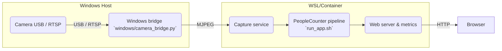
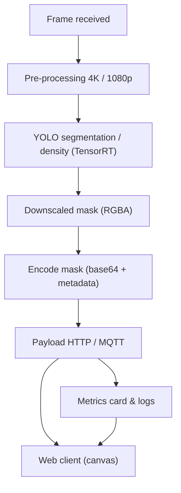
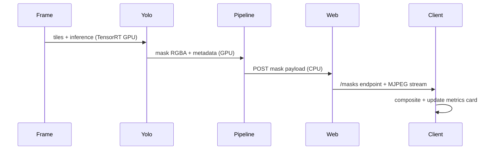
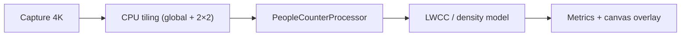

# Architecture & Data Flow

Ce document décrit la séparation hôte/pipeline, la création des masques, la télémétrie, et les flux de densité. Le guide complète [README.md](README.md) et la doc Docker, et clarifie les `.env` utilisés pour piloter les backend.

## 1. Vue globale du système



- Le bridge Windows installe Flask/OpenCV, expose `http://<IP>:5002/video_feed`, puis `run_app.sh` dans WSL consomme ce flux.
- `run_app.sh` source `scripts/configs/<profil>.env` avant de démarrer `camera_app_pipeline.py` et les moteurs `YoloSegPeopleCounter`, `PeopleCounterProcessor`, `LWCC`.
- L’interface Web récupère ensuite le flux MJPEG (caméras sans masque) et une requête distincte pour les masques, puis compose les deux sur le canvas adaptable.

## 2. Pipeline d’inférence, masques et métriques



- `YoloSegPeopleCounter` stamps `created_at`/`created_at_ts` for each mask and `_encode_mask_blob` inserts the geometry/offset data so the client aligns the overlay.
- `camera_app_pipeline.py` collects the `yolo_mask_payload_*` fields, publishes `[MASK TIMING]` logs, and ships the payload to the web server.
- `camera_app_pipeline.py` enriches the same metrics stream with `density_heatmap_payload`, a tile-level payload containing base64 PNG masks, counts, and frame coordinates so that the browser can draw density heatmaps without any server-side fusion.
- `static/js.app.js` adapts its polling interval to the YOLO FPS reports and renders the “mask timings” card (creation, send, display) for instant feedback.
- The browser pulls the MJPEG video stream separately from the mask POST, so masks are composited with an `alpha` canvas without touching the base feed.

## 3. Mask & telemetry sequence



- Each POST contains `created_at`, `created_at_ts`, and `payload_sent_at`. The client formats these timestamps on the UI and triggers an adaptive refresh via `setTimeout(adaptiveInterval)`.
- GPU vs CPU: TensorRT (YOLO) draws the masks while the CPU encodes the payload, publishes the metrics/logs, and the browser composites the canvas.
- This sequence separates the MJPEG frequency (steady) from the adaptive mask updates, highlighting why the overlay used to appear locked to the slower mask cycle until adaptive polling arrived.

## 4. Tunnel de densité



- `PeopleCounterProcessor` découpe la trame en tiles (un tile global + quatre quadrants quand `DENSITY_TILING=1`, une seule tuile sinon) et parle aux moteurs TensorRT/OpenVINO en mode batch dynamique pour traiter les crops de `544×960`.
- Plutôt que de fusionner les masques côté CPU, chaque tile passe par `_normalize_density_mask` et `_create_tile_entry` : on normalise, on applique `DENSITY_THRESHOLD`, on calcule les ratios de mise à l’échelle, puis on collecte la densité et le masque `uint8` associé.
- Les tuiles sont empaquetées dans le champ `density_heatmap_payload` de la même charge utile métrique que `yolo_mask_payload`. Chaque entrée contient le PNG encodé (`blob`), le format, le rectangle d’origine `(x0, y0, x1, y1)`, les dimensions, les facteurs d’échelle, et le compte produit. `static/js/app.js` lit ce payload, recalcule la géométrie du canvas (`frame_width` / `frame_height`), et dessine chaque tuile avec les helpers du script pour reconstituer l’overlay directement dans le navigateur.
- Cette stratégie élimine l’étape de `YOLO_MASK_DOWNSCALE`/fusion côté serveur, évite la surcharge GPU/CPU des anciennes routines `concat`/`blend`, et conserve une latence traçable via `density_heatmap_payload_latency_ms` et les timestamps `created_at` / `sent_at` qui nourrissent la carte de latence.

### 4.1 Density model architecture and diagnostics

- **Entrées et tiling** : `DENSITY_TILING` contrôle la grille envoyée à `PeopleCounterProcessor`. Les 2×2 quadrants sont construits à partir de `density_quads_coords`, la largeur/hauteur globale reste disponible dans `response['frame_width']`/`['frame_height']`, et les conversions `convert_pth_to_openvino.py` / `convert_onnx_to_trt.py` produisent des réseaux polyglottes capables d’absorber des batches multituile dynamiques.
- **Inférence** : Chaque tuile est envoyée à TensorRT/SFANet et retourne un tenseur de densité. `_create_tile_entry` normalise ce tenseur, génère un masque binaire, mesure la somme pour le `count`, et conserve les dimensions des masks et tiles pour la reconstitution côté client.
- **Sortie Web** : Au lieu de composer un masque agrégé, le pipeline transmet `density_heatmap_payload` via `/api/metrics`. Le payload contient `created_at`, `created_at_ts`, la `total_count`, et une liste de `tiles` avec leurs blobs PNG, leurs coords, et leurs ratios. `static/js/app.js` applique ces infos pour tracer chaque tile sur le canvas, donc toute recomposition devient déterministe et visible dans l’interface.
- **Diagnostic** : Pour valider la densité, observez `density_heatmap_payload.tiles` dans les métriques et comparez leur nombre à l’option `DENSITY_TILING`. Un payload vide ou des blobs absents indiquent que le modèle n’a pas produit de densité (masque à zéro). Détectez des latences en vérifiant `density_heatmap_payload_latency_ms` et le log `[MASK TIMING]` pour la stricte `created_at`/`sent_at` du payload. En cas d’anomalies, réexécutez les conversions TensorRT/OpenVINO et regardez les temps `density_time_ms` pour vous assurer que le champ `last_perf` reste stable.

## 5. `.env` profiles and key variables

- Each profile `.env` file under `scripts/configs` exports the variables that the entry script needs. Example:

```bash
export YOLO_BACKEND=tensorrt_native
export YOLO_MODEL=yolo26s-seg.engine
export YOLO_USE_GPU_PREPROC=1
export YOLO_USE_GPU_POST=1
export YOLO_PIPELINE_MODE=gpu_full
export LWCC_BACKEND=tensorrt
export DENSITY_TILING=1
export DENSITY_THRESHOLD=15
```

- `run_app.sh --profile <profile>` replaces the old positional arguments by sourcing the `.env` file before executing `camera_app_pipeline.py`. You can still override `CAMERA_URL` or `MQTT_*` variables before starting the script.

## 6. Documentation & associated plans

- This guide complements [README.md](README.md) for the quick start path and [README_DOCKER.md](README_DOCKER.md) for the container image.
- Track the masking/metrics/documentation updates via:
   - [plans/documentation-refresh-plan.md](plans/documentation-refresh-plan.md)
   - [plans/mask_overlay_roadmap.md](plans/mask_overlay_roadmap.md)
   - [plans/mask_timing-plan.md](plans/mask_timing-plan.md)
- A dedicated [plans/performance-latency-plan.md](plans/performance-latency-plan.md) now ties the latency graph, log cleanup, and 25–30 fps target into the observable flows so the UI cards reflect measurable goals.