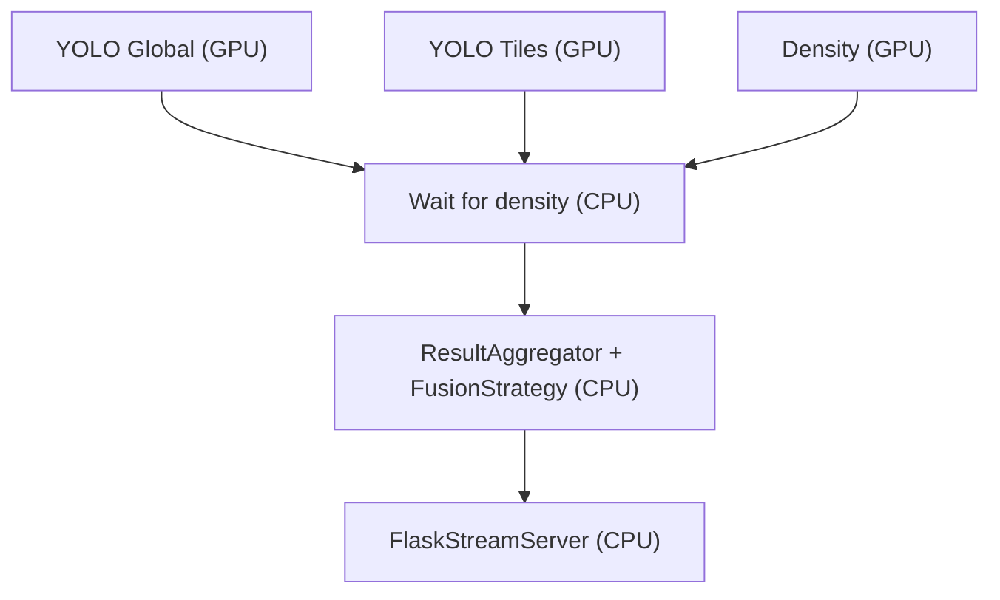
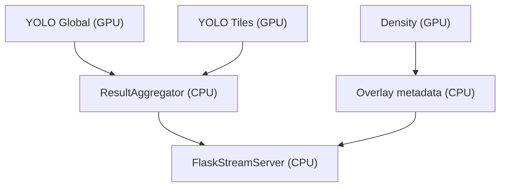
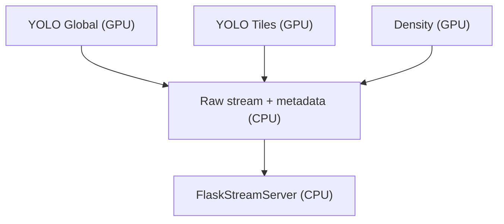

# Architecture v2

This architecture document captures the responsibility split across core, infrastructure, and application layers. The design follows SOLID principles, avoids inlined inference in Flask, and relies on frame_id propagation to keep every model independent.

## Technical context

- Python + Docker on CUDA 13.x with TensorRT-only inference (RTX 5060 Ti).
- Local 4K stream (NVDEC decode straight into GPU) feeding YOLO segmentation (global 640×640), YOLO tiling (batch 640×640 tiles), and density tiles (≈6×3 tiles at 640×720).
- Goal: 100% preprocessing/Inferences via TensorRT on CUDA streams, multi-stream transfer, no PyTorch fallback, no GPU blending (masks reach the frontend), and a clean SolID architecture layered around `config/pipeline.yaml`.
- Fusion strategies supported: `STRICT_SYNC`, `ASYNC_OVERLAY`, `RAW_STREAM_WITH_METADATA`, plus the ability to keep every stage on GPU as soon as it is efficient.

## Layers overview

- **Core**: Defines `FrameSource`, `Preprocessor`, `InferenceModel`, `Postprocessor`, `ResultPublisher`, and `FusionStrategy` interfaces.
- **Infrastructure**: Implements GPU helpers such as `CudaStreamPool`, `TensorRTExecutionContext`, `YoloGlobalTRT`, `YoloTilingTRT`, `DensityTRT`, and `FlaskStreamServer`.
- **Application**: Orchestrates the graph (`ProcessingGraph`), schedules frames with `FrameScheduler`, collects/fuses results (`ResultAggregator`), and exposes the high-level loop through `PipelineOrchestrator`.

## Dataflow (frame N and N+1)

The graph shows where each stage executes: the capture/scheduler/fusion nodes run on the CPU (with NVDEC delivering frames straight into GPU memory so scheduling can keep them there), the preprocessing and inference nodes run on CUDA streams, and Flask only publishes the merged payload without touching TensorRT. Aggregation/fusion stay on CPU today for simplicity, but their work is intentionally lightweight (just merging dictionaries) so latency remains minimal; the same interfaces can evolve into GPU-assisted merge/publish if you need even tighter deadlines.

## Fusion strategies

### STRICT_SYNC

The strict sync strategy buffers every model result, waits for density to complete, then merges and publishes a single frame payload.
The merge/fusion step itself is lightweight, so even though the coordination happens on the CPU it barely touches the GPU memory—only the TensorRT outputs cross that boundary once per frame.

### ASYNC_OVERLAY

Async overlay publishes as soon as the YOLO streams (global + tiles) are ready while density data flows independently; the UI can combine both streams client-side.
Any aggregation in this mode just stamps metadata onto the YOLO payload before publishing, keeping the GPU busy with inference and avoiding extra copies.

### RAW_STREAM_WITH_METADATA

Raw stream mode forwards whatever payload arrives without waiting, providing the browser full control over masks, density heatmaps, and fusion decisions.
This mode keeps latency tight by issuing GPU-ready payloads directly; the CPU merely orchestrates the streams so TensorRT stays in charge of the heavy lifting.

## CUDA multi-streams

- `config/pipeline.yaml` selects stream indices for transfer, YOLO, and density so every inference context acquires its own CUDA slot.
- `CudaStreamPool` hands each named key (transfer/yolo/density) a dedicated stream, while `GPUBufferPool` ensures buffers are reused across models without extra copies.

## Log channel configuration

- `config/log.yaml` toggles the `GLOBAL`, `YOLO`, and `DENSITY` channels used by `logger/filtered_logger.py` so v2 logs stay concise.
- `apply_log_config()` reads that YAML and updates the shared logger before the pipeline starts, keeping channel logic centralized and SOLID-friendly.

## Flask boundary

`FlaskStreamServer` only publishes aggregated results; it never runs inference or blocks on CUDA, keeping the infrastructure layer isolated from business logic while the application orchestrator drives the loop.
