# Architecture v2

This architecture document captures the responsibility split across core, infrastructure, and application layers. The design follows SOLID principles, avoids inlined inference in Flask, and relies on frame_id propagation to keep every model independent.

## Layers overview

- **Core**: Defines `FrameSource`, `Preprocessor`, `InferenceModel`, `Postprocessor`, `ResultPublisher`, and `FusionStrategy` interfaces.
- **Infrastructure**: Implements CUDA-enabled helpers such as `CudaStreamPool`, `TensorRTExecutionContext`, `YoloGlobalTRT`, `YoloTilingTRT`, `DensityTRT`, and `FlaskStreamServer`.
- **Application**: Orchestrates the graph (`ProcessingGraph`), schedules frames (`FrameScheduler`), collects + fuses results (`ResultAggregator`), and exposes the high-level loop (`PipelineOrchestrator`).

## Dataflow (frame N and N+1)

```mermaid
flowchart LR
    FrameSource -->|frame_id N| FrameScheduler
    FrameScheduler --> Preprocessor
    Preprocessor -->|tile buffers| TensorRTExecutionContext
    TensorRTExecutionContext -->|raw tensors| Postprocessor
    Postprocessor --> ResultAggregator
    ResultAggregator --> FusionStrategy
    FusionStrategy --> FlaskStreamServer
    FlaskStreamServer --> UI[Flask UI]
    FrameScheduler -->|frame N+1| Preprocessor
    FrameSource -->|frame_id N+1| FrameScheduler
```

## CUDA multi-streams

- `config/pipeline.yaml` selects stream indices for transfer, YOLO, and density.
- `CudaStreamPool` hands each model a dedicated slot so transfers, inference, and density can overlap without blocking.

## Fusion strategies

Each `FusionStrategyType` triggers different publication models:

- `STRICT_SYNC`: wait for every model (global, tiles, density) before publishing.
- `ASYNC_OVERLAY`: publish as soon as the YOLO stream is ready but keep density metadata for overlays.
- `RAW_STREAM_WITH_METADATA`: send raw payloads immediately with metadata for the UI to decide.

The `ResultAggregator` holds partial results per frame_id and calls the `FusionStrategy` to decide when to flush.

## Flask boundary

`FlaskStreamServer` only publishes data; it never runs inference or blocking CUDA code. This keeps the infrastructure layer free of business logic, and the application layer (PipelineOrchestrator) drives the loop.
