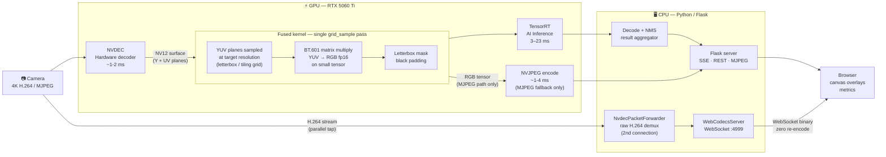
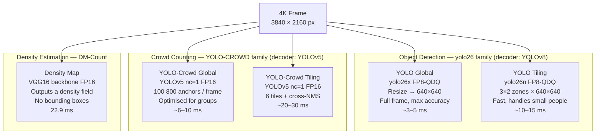
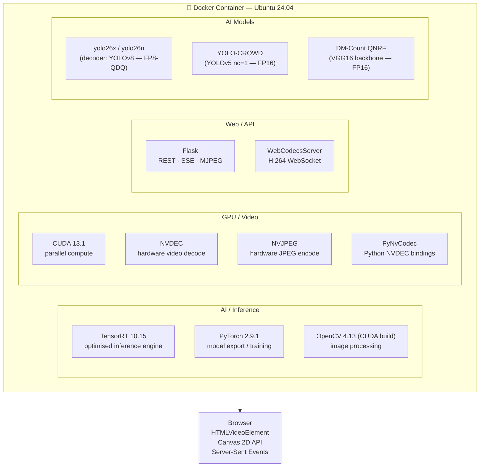

# PeopleCounter — Maker Faire Exhibition Guide

> Five self-contained panels explaining the system at different levels of detail.
> **Language**: English. A French version (`MAKER_FAIRE_FR.md`) will follow.

---

# PANEL 1 — What Does It Do?

## Real-time AI crowd counting on a 4K camera stream


**PeopleCounter** counts and locates people on a live 4K camera feed using
multiple AI models running entirely on a consumer GPU.

### What you see on screen

- **Live 4K video** with AI overlays drawn on top in real time
- **Person count** updated every second
- **6 selectable AI modes** — switch between them live with a single click
- **Performance charts**: GPU load, count history, end-to-end latency

### What it detects

| Mode | AI technique | What you see |
|------|-------------|-------------|
| YOLO Global | Object detection (full frame) | Green bounding boxes + body silhouettes |
| YOLO Tiling | Object detection (6 zones) | Boxes on difficult/small subjects |
| Density Map | Density estimation (crowd counting) | Colour heatmap — red = dense area |
| YOLO-Crowd Global | Crowd-tuned detector | Boxes optimised for packed groups |
| YOLO-Crowd Tiling | Crowd-tuned detector + tiling | Best coverage for dense scenes |
| Passthrough | None | Raw video feed, no processing |

### Key achievement

> "The entire AI pipeline — from camera pixel to screen overlay — runs in  
> under **33 ms** on a single GPU, processing **4K resolution** video."

---

# PANEL 2 — Inside the GPU Pipeline

## Every stage runs on the GPU — the CPU is just the conductor



> **Two video output paths — only one active at a time:**
> - **WebCodecs** (preferred): raw H.264 packets forwarded directly to the browser, decoded natively with the `VideoDecoder` API — no GPU re-encode, no NV12→RGB conversion for display.
> - **MJPEG** (fallback): when no WebCodecs client is connected, NVJPEG encodes the NV12 frame to JPEG and pushes it via Flask MJPEG stream.  NVJPEG is **skipped entirely** while WebCodecs clients are active.

### Why keep it on the GPU?

| Approach | Data path | Latency |
|----------|-----------|---------|
| CPU pipeline | camera → CPU decode → CPU resize → GPU infer → CPU draw | high — many memory copies |
| **GPU pipeline (this project)** | camera → **GPU decode → GPU resize → GPU infer** → browser | **low — zero CPU copies** |

### The key tricks: NVDEC + fused kernel + GpuTensorPool

1. **NVDEC** (hardware video decode chip built into the GPU) decodes the camera stream **without using any GPU shader cores** — it's literally free compute.
2. **Fused CUDA kernel** (`nv12_to_rgb_nchw_fp16_letterbox` / `nv12_tiles_to_rgb_nchw_fp16_batch`): instead of decoding to full-resolution RGB then resizing, a single `grid_sample` call samples the raw YUV planes **directly at the target resolution** (e.g. 640×640), then applies the BT.601 YUV→RGB matrix multiply on the **small** tensor.
   - Avoids the ~25 MB full-resolution RGB intermediate (NV12 = 1.5 bytes/pixel vs RGB = 3 bytes/pixel)
   - The letterbox geometry is applied **in YUV space** — the RGB conversion never sees the full frame
   - Plane buffer caches (`_PLANE_BUFFER_CACHE`, keyed by CUDA stream) and sampling grid caches (`_LETTERBOX_GRID_CACHE`, `_BATCH_GRID_CACHE`) are computed once and reused every frame
3. A **GpuTensorPool** (a GPU memory cache) holds pre-allocated tensor buffers — so each frame doesn't allocate new GPU memory.
4. **TensorRT** runs the AI model with compiler-optimised FP8 kernels — 8-bit floating point, half the memory bandwidth of FP16.

### CUDA stream parallelism

Different stages run on different **CUDA streams** (GPU work queues) so they overlap:

```
Stream 0: ──[DMA transfer]───────────────────────────────────
Stream 1: ────────────────[YOLO inference]───────────────────
Stream 3: ──────────────[YOLO global preprocess]─────────────
Stream 4: ──────────────[YOLO tiles preprocess]──────────────
                         (both run simultaneously ↑)
```

---

# PANEL 3 — Five Ways to See the Crowd

## Different AI models, different strengths



### How does tiling work?

A single high-resolution frame is divided into a **3×2 grid of overlapping zones**.
Each zone is processed independently by the AI model.

```
┌──────────┬──────────┬──────────┐
│  Zone 1  │  Zone 2  │  Zone 3  │
│  640×640 │  640×640 │  640×640 │
├──────────┼──────────┼──────────┤
│  Zone 4  │  Zone 5  │  Zone 6  │
│  640×640 │  640×640 │  640×640 │
└──────────┴──────────┴──────────┘
    20% overlap at each border — nobody gets cut off
```

**Why tile?** A 4K frame downscaled to 640×640 loses 36× resolution.
A person who is 50 pixels tall at native resolution becomes just **1.4 pixels** — invisible to AI.
Tiling preserves local resolution.

### How does density estimation work differently?

Instead of detecting each person, DM-Count learns a **spatial density function** from thousands of labelled crowd images. It outputs a **heatmap** where each pixel value represents the local person density. Summing over the heatmap gives the total count.

- **Advantage**: works in very dense crowds where bounding boxes overlap and NMS fails.
- **Trade-off**: no individual person localisation, no bounding boxes — only count and density map.

---

# PANEL 4 — Performance: The Numbers

## Hardware

| Component | Spec |
|-----------|------|
| GPU | NVIDIA RTX 5060 Ti — Blackwell architecture (sm_120) |
| VRAM | 16 GB GDDR7 — 448 GB/s memory bandwidth |
| CUDA | 13.1 |
| TensorRT | 10.15.1 |
| Docker | Ubuntu 24.04 container |

---

## Pipeline latency at a glance

```
Camera pixel → Browser overlay

 0 ms ──────────────────────────────────────────────── ~33 ms
 │                │             │              │
[NVDEC]       [Preproc]   [TensorRT]     [Browser]
 ~2-3 ms         ~3-5 ms     3–23 ms         ~5 ms
```

| Stage | Time | Processing unit |
|-------|-----:|-----------------|
| NVDEC hardware decode | ~2-3 ms | GPU (fixed hardware decoder) |
| NV12→RGB CUDA kernel | ~3-5 ms | GPU (shader cores) |
| Preprocessing (letterbox / tiling) | ~1-4 ms | GPU (CUDA kernels, parallel) |
| TensorRT AI inference | 3–23 ms | GPU (Tensor Cores) |
| Result decode + NMS | ~5 ms | CPU |
| Flask → browser | ~5 ms | CPU / network |
| **Total end-to-end** | **~12-33 ms** | — |

---

## Model performance table

| AI Model | Decoder | Input | Precision | Latency | FPS equiv |
|----------|---------|-------|-----------|--------:|----------:|
| yolo26x (global) | YOLOv8 | 640×640 | FP8-QDQ | ~3–5 ms | >200 fps |
| yolo26n (6 tiles) | YOLOv8 | 6 × 640×640 | FP8-QDQ | ~10–15 ms | ~70 fps |
| DM-Count QNRF | 1920×1088 | FP16 | **22.9 ms** | 43 fps |
| YOLO-CROWD (global) | 640×640 | FP16 | ~6–10 ms | ~120 fps |
| YOLO-CROWD (6 tiles) | 6 × 640×640 | FP16 | ~20–30 ms | ~40 fps |

---

## What is FP8-QDQ?

Modern NVIDIA GPUs have dedicated **Tensor Core** hardware for integer and low-precision arithmetic.

| Precision | Bits per weight | Relative speed | Quality |
|-----------|----------------|----------------|---------|
| FP32 | 32 bits | 1× baseline | full |
| FP16 | 16 bits | ~2× faster | near-full |
| **FP8-QDQ** | **8 bits** | **~3–4× faster** | very close to FP16 |
| INT8 | 8 bits | ~3–4× faster | requires calibration |

FP8-QDQ (Quantize-Dequantize) inserts calibration nodes at training time so the model
auto-compensates for reduced precision — YOLO accuracy is maintained at half the memory footprint.

---

## Test coverage

**199 unit and integration tests** pass in the production Docker image at each code change:

```bash
./5_run_tests.sh   # runs inside people-counter:gpu-final-nvdec container
# → 199 passed, 1 skipped in ~29 s
```

Tests cover: CUDA kernels · tensor pool · NVDEC decoder · pipeline orchestrator ·
YOLO decoders · density decoder · Flask server · WebCodecs server.

---

# PANEL 5 — Technology Stack

## Software stack (inside Docker)



## Model zoo

| Model | Architecture | Decoder | Task | Engine |
|-------|-------------|---------|------|--------|
| yolo26x | CSPDarknet + neck | YOLOv8 | detection + segmentation | FP8-QDQ `.engine` |
| yolo26n | CSPDarknet (nano) | YOLOv8 | detection only (fast) | FP8-QDQ `.engine` |
| YOLO-CROWD | YOLOv5 nc=1 + P2/4 head | YOLOv5 | crowd detection | FP16 `.engine` |
| DM-Count QNRF | VGG16 + density head | — | crowd counting | FP16 `.engine` |

> **Model naming**: The inference models are **yolo26** (YOLO v26 family). "YOLOv8" refers
> to the TensorRT decoder format — the same decoder handles yolo26, YOLO11, and YOLOv8
> output tensors. The trained weights themselves are yolo26.

All engines are compiled by **TensorRT** from ONNX exports using the
`export_yolos_to_trt.py` / `export_density_to_onnx.py` scripts.
Engines are hardware-specific: the `.engine` files in this repository are
compiled for RTX 5060 Ti (CUDA compute capability sm_120).

## Clean Architecture

`app_v2` follows a strict layered design:

```
core/           — abstract interfaces (FrameSource, InferenceModel, ResultPublisher…)
application/    — orchestration logic (PipelineOrchestrator, FrameScheduler…)
infrastructure/ — concrete implementations (NVDEC, TensorRT, Flask, WebCodecs…)
kernels/        — CUDA kernels (NV12 bridge, letterbox, tiling)
```

No infrastructure code is imported by `core/`. Interfaces are tested with mock
implementations. This makes unit testing possible without a GPU.

## Open source components used

| Component | License | Role |
|-----------|---------|------|
| PyTorch | BSD-3 | model export |
| Ultralytics YOLOv8 | AGPL-3.0 | detection architecture |
| OpenCV | Apache-2.0 | image processing |
| Flask | BSD-3 | web server |
| TensorRT | NVIDIA proprietary | inference engine |
| CUDA / NVDEC | NVIDIA proprietary | GPU compute / video decode |
| DM-Count | MIT-like | density estimation |
| YOLO-CROWD | GPL-3.0 | crowd detection |
