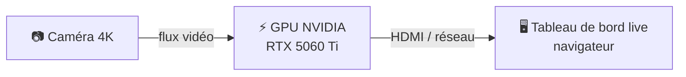
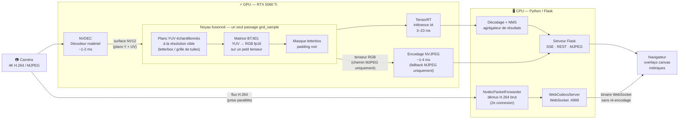
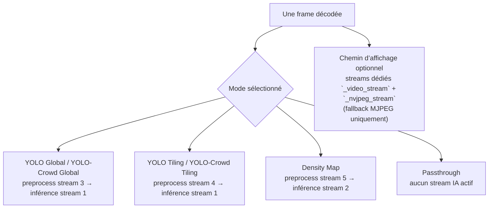
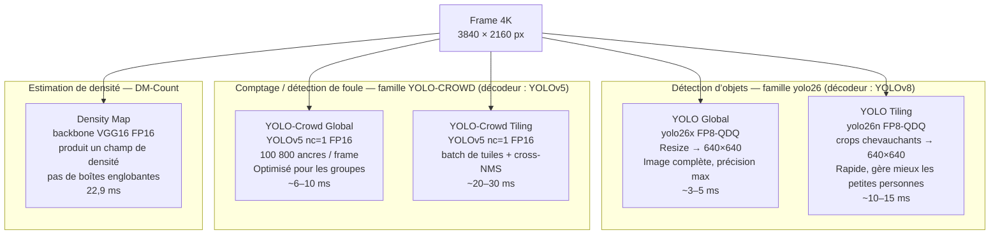
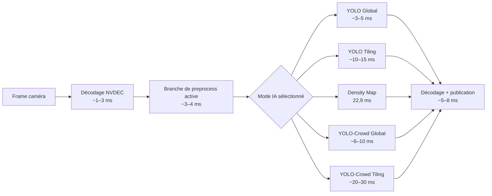
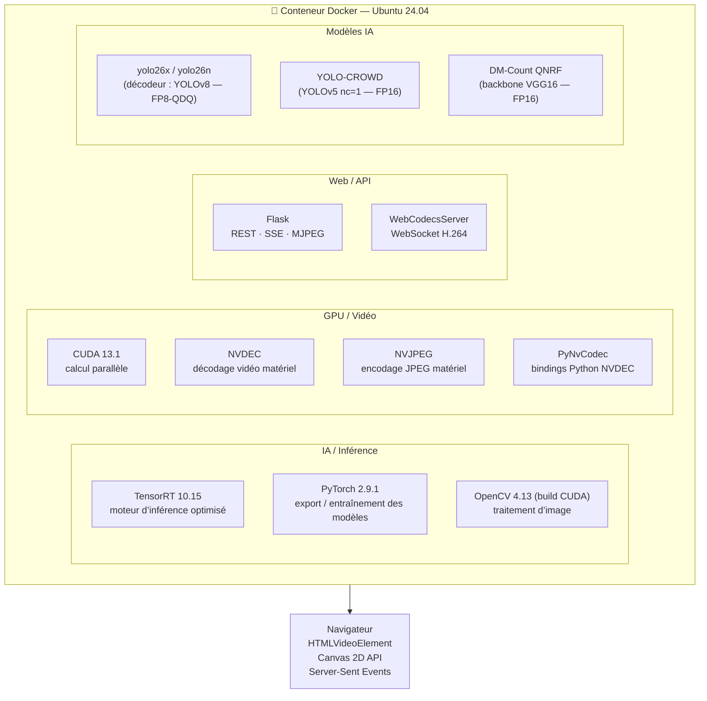

# PeopleCounter — Guide d’exposition Maker Faire

> Cinq panneaux autonomes expliquant le système à différents niveaux de détail.
> **Langue** : français. La version anglaise reste disponible dans `MAKER_FAIRE.md`.

## Ressources visuelles disponibles

- Poster A3 portrait : `assets/poster_tiling_expo_a3_fr.svg`
- Infographie 1 : `assets/tiling_crowd_tiles_workflow_fr.svg`
- Infographie 2 : `assets/tiling_overlap_vs_letterbox_fr.svg`

---

# PANNEAU 1 — À quoi ça sert ?

## Comptage de foule par IA en temps réel sur un flux caméra 4K



**PeopleCounter** compte et localise les personnes sur un flux caméra 4K en direct, en utilisant plusieurs modèles d’IA exécutés entièrement sur un GPU grand public.

### Ce que l’on voit à l’écran

- **Vidéo 4K en direct** avec superpositions IA en temps réel
- **Nombre de personnes** mis à jour chaque seconde
- **6 modes IA sélectionnables** — bascule en direct en un clic
- **Graphiques de performance** : charge GPU, historique de comptage, latence bout en bout

### Ce que le système détecte

| Mode | Technique IA | Ce que l’on voit |
|------|-------------|------------------|
| YOLO Global | Détection d’objets (image complète) | Boîtes vertes + silhouettes corporelles |
| YOLO Tiling | Détection d’objets par tuiles | Boîtes sur sujets difficiles / petits |
| Density Map | Estimation de densité (crowd counting) | Carte thermique couleur — rouge = zone dense |
| YOLO-Crowd Global | Détecteur spécialisé foule | Boîtes optimisées pour groupes compacts |
| YOLO-Crowd Tiling | Détecteur foule + tiling | Meilleure couverture sur scènes denses |
| Passthrough | Aucune IA | Flux vidéo brut, sans traitement |

### Performance clé

> « Toute la pipeline IA — du pixel caméra à l’overlay affiché à l’écran — fonctionne
> en **moins de 33 ms** sur un seul GPU, tout en traitant une vidéo en **résolution 4K**. »

---

# PANNEAU 2 — À l’intérieur de la pipeline GPU

## Chaque étape tourne sur le GPU — le CPU joue seulement le rôle de chef d’orchestre



> **Deux chemins de sortie vidéo — un seul actif à la fois :**
> - **WebCodecs** (préféré) : les paquets H.264 bruts sont transmis directement au navigateur, décodés nativement avec l’API `VideoDecoder` — pas de ré-encodage GPU, pas de conversion NV12→RGB pour l’affichage.
> - **MJPEG** (fallback) : lorsqu’aucun client WebCodecs n’est connecté, NVJPEG encode la frame NV12 en JPEG puis l’envoie via le flux MJPEG Flask. NVJPEG est **complètement désactivé** tant qu’un client WebCodecs est actif.

### Pourquoi tout garder sur le GPU ?

| Approche | Chemin de données | Latence |
|----------|-------------------|---------|
| Pipeline CPU | caméra → décodage CPU → resize CPU → inférence GPU → dessin CPU | élevée — nombreuses copies mémoire |
| **Pipeline GPU (ce projet)** | caméra → **décodage GPU → resize GPU → inférence GPU** → navigateur | **faible — zéro copie CPU** |

### Les astuces clés : NVDEC + noyau fusionné + GpuTensorPool

1. **NVDEC** (bloc matériel de décodage vidéo intégré au GPU) décode le flux caméra **sans utiliser les cœurs de calcul GPU** — en pratique, c’est du calcul presque « gratuit ».
2. **Noyau CUDA fusionné** (`nv12_to_rgb_nchw_fp16_letterbox` / `nv12_tiles_to_rgb_nchw_fp16_batch`) : au lieu de décoder toute l’image en RGB pleine résolution puis de la redimensionner, un seul appel `grid_sample` échantillonne directement les plans YUV **à la résolution cible** (par exemple 640×640), puis applique la matrice BT.601 YUV→RGB sur le **petit** tenseur obtenu.
   - Évite l’intermédiaire RGB pleine résolution d’environ 25 Mo (NV12 = 1,5 octet/pixel contre RGB = 3 octets/pixel)
   - La géométrie letterbox est appliquée **dans l’espace YUV** — la conversion RGB ne voit jamais la frame complète
   - Les caches de buffers de plans (`_PLANE_BUFFER_CACHE`, indexés par stream CUDA) et les caches de grilles d’échantillonnage (`_LETTERBOX_GRID_CACHE`, `_BATCH_GRID_CACHE`) sont calculés une seule fois puis réutilisés à chaque frame
3. Un **GpuTensorPool** (cache mémoire GPU) conserve des buffers de tenseurs préalloués — on évite ainsi les allocations GPU à chaque image.
4. **TensorRT** exécute le modèle IA avec des noyaux FP8 optimisés — 8 bits flottants, donc moitié moins de bande passante mémoire que le FP16.

### Parallélisme des streams CUDA

La configuration YAML réserve **6 IDs logiques de streams CUDA** — mais ils ne font **pas tous** un travail utile à chaque frame.

| ID du stream | Rôle réservé | Utilisé par |
|-------------:|--------------|-------------|
| 0 | transfert / stream par défaut | travail GPU bas niveau partagé |
| 1 | inférence famille YOLO | `yolo_global`, `yolo_tiles`, `crowd_global`, `crowd_tiles` |
| 2 | inférence density | `density` |
| 3 | preprocess global | `yolo_global`, `crowd_global` |
| 4 | preprocess tiled | `yolo_tiles`, `crowd_tiles` |
| 5 | preprocess density | `density` |

> **Important :** l’interface n’expose **qu’un mode d’inférence à la fois**. En exécution réelle, l’orchestrateur n’active que la branche modèle sélectionnée et sa branche de preprocess associée.
>
> La vraie photo d’une frame est donc :
>
> - **un seul stream de preprocess actif** pour le mode choisi,
> - **un seul stream d’inférence actif** pour le mode choisi,
> - plus des streams vidéo séparés hors `pipeline.yaml` lorsque MJPEG est utilisé.



Cette représentation est plus fidèle que de dessiner `yolo_global`, `yolo_tiles` et `density` comme s’ils traitaient tous la même frame en parallèle — ce sont des **branches alternatives**, pas des branches concurrentes en production.

---

# PANNEAU 3 — Cinq façons de voir la foule

## Différents modèles IA, différentes forces



### Comment fonctionne le tiling ?

Une frame haute résolution est divisée en **crops carrés qui se chevauchent**.
Chaque crop est traité indépendamment par le modèle IA.

```
┌──────────┬──────────┬──────────┬──────────┐
│ crop  1  │ crop  2  │ crop  3  │ crop  4  │
│ overlap  │ overlap  │ overlap  │ clampé   │
├──────────┼──────────┼──────────┼──────────┤
│ crop  5  │ crop  6  │ crop  7  │ crop  8  │
│ overlap  │ overlap  │ overlap  │ clampé   │
└──────────┴──────────┴──────────┴──────────┘
 overlap nominal = 20% ; l’overlap en bord peut être plus grand car le dernier crop est clampé au bord de l’image
```

**Pourquoi tuiler ?** Une frame 4K redimensionnée globalement en 640×640 perd un facteur 36 en résolution.
Une personne de 50 pixels de haut en résolution native devient **1,4 pixel** — invisible pour le modèle.
Le tiling conserve plus de résolution locale.

### En quoi l’estimation de densité est-elle différente ?

Au lieu de détecter chaque personne individuellement, DM-Count apprend une **fonction de densité spatiale** à partir de milliers d’images annotées. Il produit une **carte thermique** où chaque pixel représente la densité locale de personnes. En sommant cette carte, on obtient le nombre total.

- **Avantage** : fonctionne bien dans les foules très denses où les boîtes se recouvrent et où le NMS échoue.
- **Compromis** : pas de localisation individuelle fine, pas de boîtes — uniquement le comptage et la densité.

---

# PANNEAU 4 — Performance : les chiffres

## Matériel

| Composant | Spécification |
|-----------|---------------|
| GPU | NVIDIA RTX 5060 Ti — architecture Blackwell (sm_120) |
| VRAM | 16 Go GDDR7 — 448 Go/s de bande passante mémoire |
| CUDA | 13.1 |
| TensorRT | 10.15.1 |
| Docker | conteneur Ubuntu 24.04 |

---

## Latence de pipeline en un coup d’œil

Le timing exact dépend du **mode sélectionné**. La manière la plus sûre de l’expliquer est de séparer les **étapes communes** de la **branche IA active**.



La lecture correcte de la latence est donc :

- **coût fixe** : décodage + routage / préparation du preprocess
- **une seule branche IA active** : choisie par l’utilisateur
- **coût de publication / affichage** : transport navigateur + rendu des overlays

| Étape | Temps | Unité de traitement |
|------|------:|---------------------|
| Décodage matériel NVDEC | ~1-3 ms | décodeur matériel GPU |
| Branche de preprocess active | ~3-4 ms | stream CUDA GPU (selon le mode) |
| Inférence IA TensorRT | ~3-30 ms | Tensor Cores / CUDA du GPU |
| Décodage résultat + publication | ~5-8 ms | CPU + réseau / navigateur |
| **Total bout en bout** | **dépend du mode** | — |

---

## Tableau de performance des modèles

| Modèle IA | Décodeur | Entrée | Précision | Latence | FPS équivalent |
|----------|----------|--------|-----------|--------:|---------------:|
| yolo26x (global) | YOLOv8 | 640×640 | FP8-QDQ | ~3–5 ms | >200 fps |
| yolo26n (tiling) | YOLOv8 | batch de tuiles 640×640 | FP8-QDQ | ~10–15 ms | ~70 fps |
| DM-Count QNRF | — | 1920×1088 | FP16 | **22,9 ms** | 43 fps |
| YOLO-CROWD (global) | YOLOv5 | 640×640 | FP16 | ~6–10 ms | ~120 fps |
| YOLO-CROWD (tiling) | YOLOv5 | batch de tuiles 640×640 | FP16 | ~20–30 ms | ~40 fps |

---

## Qu’est-ce que le FP8-QDQ ?

Les GPU NVIDIA modernes disposent de matériel dédié **Tensor Core** pour les calculs entiers et basse précision.

| Précision | Bits par poids | Vitesse relative | Qualité |
|-----------|----------------|------------------|---------|
| FP32 | 32 bits | 1× base | complète |
| FP16 | 16 bits | ~2× plus rapide | quasi complète |
| **FP8-QDQ** | **8 bits** | **~3–4× plus rapide** | très proche du FP16 |
| INT8 | 8 bits | ~3–4× plus rapide | nécessite une calibration |

FP8-QDQ (Quantize-Dequantize) insère des nœuds de calibration au moment de l’export / entraînement afin que le modèle compense automatiquement la baisse de précision — l’accuracy YOLO reste très proche du FP16, avec une empreinte mémoire divisée par deux.

---

## Couverture de tests

**199 tests unitaires et d’intégration** passent dans l’image Docker de production à chaque changement de code :

```bash
./5_run_tests.sh   # lancé dans le conteneur people-counter:gpu-final-nvdec
# → 199 passed, 1 skipped en ~29 s
```

Les tests couvrent : noyaux CUDA · tensor pool · décodeur NVDEC · orchestrateur de pipeline · décodeurs YOLO · décodeur density · serveur Flask · serveur WebCodecs.

---

# PANNEAU 5 — Pile technologique

## Stack logicielle (dans Docker)



## Zoo de modèles

| Modèle | Architecture | Décodeur | Tâche | Moteur |
|--------|-------------|----------|------|--------|
| yolo26x | CSPDarknet + neck | YOLOv8 | détection + segmentation | `.engine` FP8-QDQ |
| yolo26n | CSPDarknet (nano) | YOLOv8 | détection seule (rapide) | `.engine` FP8-QDQ |
| YOLO-CROWD | YOLOv5 nc=1 + tête P2/4 | YOLOv5 | détection de foule | `.engine` FP16 |
| DM-Count QNRF | VGG16 + tête densité | — | crowd counting | `.engine` FP16 |

> **Nommage des modèles** : les modèles d’inférence sont des **yolo26** (famille YOLO v26). « YOLOv8 » désigne ici le format du décodeur TensorRT — le même décodeur gère les tenseurs de sortie yolo26, YOLO11 et YOLOv8. Les poids entraînés eux-mêmes sont bien des yolo26.

Tous les moteurs sont compilés par **TensorRT** à partir d’exports ONNX via les scripts
`export_yolos_to_trt.py` / `export_density_to_onnx.py`.
Les fichiers `.engine` sont spécifiques au matériel : ceux présents dans ce dépôt sont compilés pour RTX 5060 Ti (compute capability CUDA `sm_120`).

## Architecture propre

`app_v2` suit une architecture en couches stricte :

```
core/           — interfaces abstraites (FrameSource, InferenceModel, ResultPublisher…)
application/    — logique d’orchestration (PipelineOrchestrator, FrameScheduler…)
infrastructure/ — implémentations concrètes (NVDEC, TensorRT, Flask, WebCodecs…)
kernels/        — noyaux CUDA (pont NV12, letterbox, tiling)
```

Aucun code d’infrastructure n’est importé par `core/`. Les interfaces sont testées avec des implémentations mockées, ce qui rend les tests unitaires possibles sans GPU.

## Composants open source utilisés

| Composant | Licence | Rôle |
|-----------|---------|------|
| PyTorch | BSD-3 | export de modèles |
| Ultralytics YOLOv8 | AGPL-3.0 | architecture de détection |
| OpenCV | Apache-2.0 | traitement d’image |
| Flask | BSD-3 | serveur web |
| TensorRT | propriétaire NVIDIA | moteur d’inférence |
| CUDA / NVDEC | propriétaire NVIDIA | calcul GPU / décodage vidéo |
| DM-Count | MIT-like | estimation de densité |
| YOLO-CROWD | GPL-3.0 | détection de foule |
