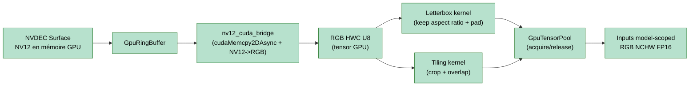
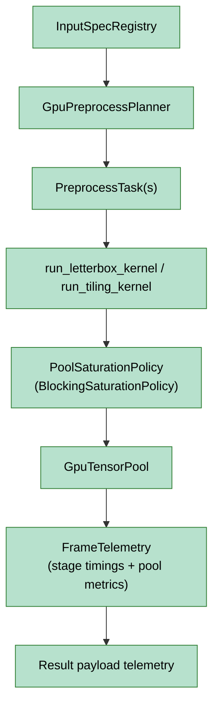

# Architecture v2

Ce document décrit l’architecture cible de `app_v2` et l’état d’avancement des composants.

## Légende d’avancement

- **Vert**: terminé
- **Orange**: en cours / partiellement implémenté
- **Rouge**: restant

## Dataflow global (état courant)

```mermaid
flowchart LR
    FrameSource["FrameSource"]:::done --> NVDEC["NVDEC decode\n(GPU surface)"]:::done
    NVDEC --> Scheduler["FrameScheduler"]:::done
    Scheduler --> Preprocessor["GpuPreprocessor"]:::done
    Preprocessor --> TRT["TensorRT infer\n(YOLO global/tiles)"]:::partial
    TRT --> Aggregator["ResultAggregator\n+ FusionStrategy"]:::done
    Aggregator --> Publisher["FlaskStreamServer"]:::done
    Publisher --> UI["Web UI"]:::partial

    classDef done fill:#b7e1cd,color:#000,stroke:#2e7d32,stroke-width:1px;
    classDef partial fill:#ffd9b3,color:#000,stroke:#ef6c00,stroke-width:1px;
    classDef todo fill:#f4b6b6,color:#000,stroke:#c62828,stroke-width:1px;
```

## Zoom NVDEC -> PreProcessor

## Zoom PreProcessor (nouveaux composants)

## Points restant à ce stade

- Kernel fusionné NV12→RGB + resize/letterbox en un seul kernel CUDA custom (reporté volontairement).
- Intégration/optimisation côté modèle density/LWCC (après stabilisation YOLO).
- Auto-tuner de dimensionnement du pool (gardé pour la phase de fin de dev).
