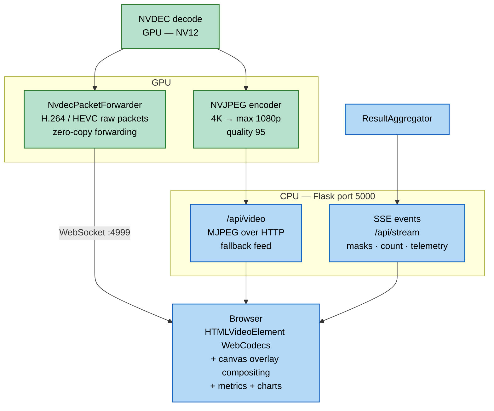
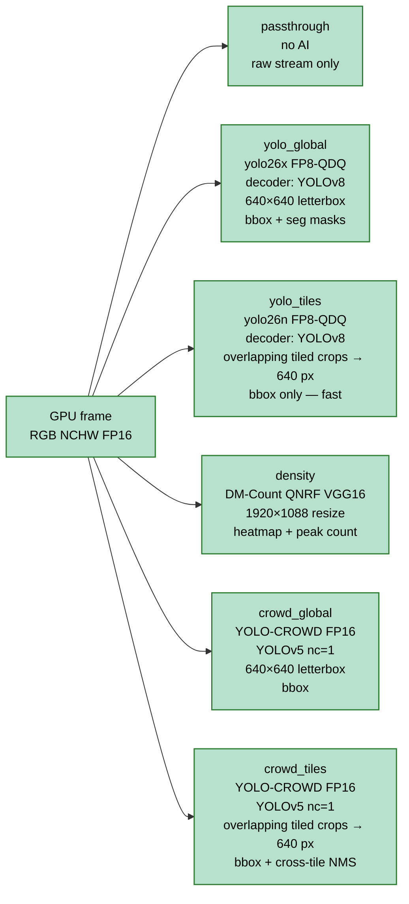
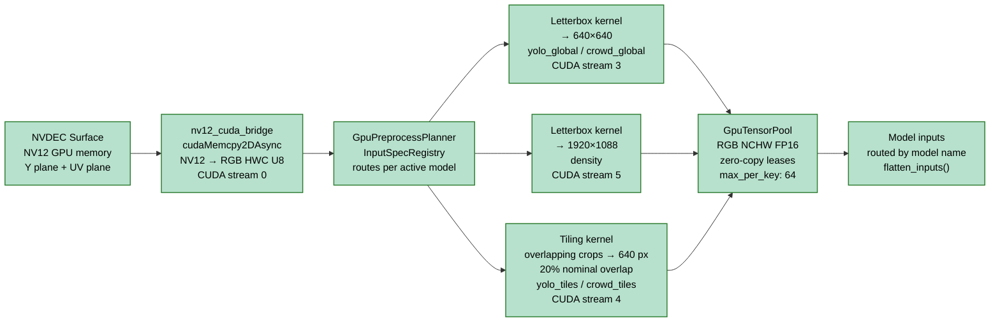
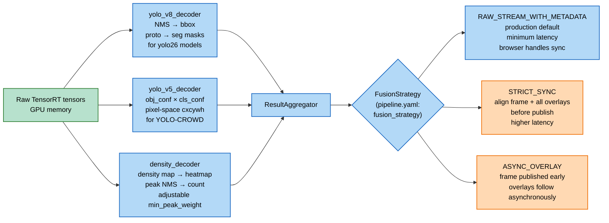

# Architecture — app_v2

> **Status**: All core pipeline components are complete and running in production.
> **Hardware**: RTX 5060 Ti (Blackwell sm_120, 16 GB GDDR7, 448 GB/s) · CUDA 13.1 · TensorRT 10.15

## Legend

| Symbol | Meaning |
|--------|---------|
| ✅ | Fully implemented and running |
| 🚧 | Work in progress / partially implemented |
| ⏳ | Planned / future |

**Diagram colour code**: 🟩 green box = runs on **GPU** · 🟦 blue box = runs on **CPU**

---

## 1. Global Data Flow

> Every frame travels entirely on the GPU from NVDEC decode to NVJPEG encode.  
> The CPU handles only Python control-flow, Flask I/O, and WebSocket framing.

```mermaid
flowchart LR
    source["📷 Camera / RTSP<br/>USB · H.264 · MJPEG"]:::gpu
    nvdec["NVDEC<br/>Hardware decode<br/>GPU — NV12 surface"]:::gpu
    ring["GpuRingBuffer<br/>GPU VRAM"]:::gpu
    bridge["nv12_cuda_bridge<br/>NV12 → RGB HWC<br/>CUDA kernel"]:::gpu
    preproc["GpuPreprocessor<br/>letterbox / tiling<br/>CUDA kernels"]:::gpu
    pool["GpuTensorPool<br/>RGB NCHW FP16<br/>zero-copy leases"]:::gpu
    trt["TensorRT Inference<br/>5 models + passthrough<br/>GPU"]:::gpu
    agg["ResultAggregator<br/>+ FusionStrategy<br/>CPU"]:::cpu
    flask["FlaskStreamServer<br/>SSE · MJPEG · REST<br/>CPU / NVJPEG encode"]:::cpu
    ws["WebCodecsServer<br/>H.264 WebSocket<br/>port 4999"]:::cpu
    ui["Browser UI<br/>6 modes · overlays<br/>charts · metrics"]:::cpu

    source --> nvdec --> ring --> bridge --> preproc --> pool --> trt --> agg --> flask --> ui
    nvdec --> ws --> ui

    classDef gpu fill:#b7e1cd,color:#000,stroke:#2e7d32,stroke-width:1.5px;
    classDef cpu fill:#b3d9f7,color:#000,stroke:#1565c0,stroke-width:1.5px;
    classDef wip fill:#ffd9b3,color:#000,stroke:#ef6c00,stroke-width:1.5px;
```

---

## 2. Video Stream Layers

Three parallel streams deliver content to the browser simultaneously.

**SSE (Server-Sent Events)**: a lightweight HTTP/1.1 protocol where the server
pushes newline-delimited JSON events to the browser over a persistent connection.
The browser reads them with the `EventSource` JavaScript API. Used here to
deliver AI results (masks, count, telemetry) without polling.

```mermaid
flowchart TB
    nvdec["NVDEC decode<br/>GPU — NV12"]:::gpu

    subgraph gpu_side["GPU"]
        nvjpeg["NVJPEG encoder<br/>4K → max 1080p<br/>quality 95"]:::gpu
        fwd["NvdecPacketForwarder<br/>H.264 / HEVC raw packets<br/>zero-copy forwarding"]:::gpu
    end

    subgraph cpu_side["CPU — Flask port 5000"]
        sse["SSE events<br/>/api/stream<br/>masks · count · telemetry"]:::cpu
        mjpeg["/api/video<br/>MJPEG over HTTP<br/>fallback feed"]:::cpu
    end

    browser["Browser<br/>HTMLVideoElement WebCodecs<br/>+ canvas overlay compositing<br/>+ metrics + charts"]:::cpu

    agg["ResultAggregator"]:::cpu

    nvdec --> nvjpeg --> mjpeg
    nvdec --> fwd
    agg --> sse
    mjpeg --> browser
    fwd -->|"WebSocket :4999"| browser
    sse --> browser

    classDef gpu fill:#b7e1cd,color:#000,stroke:#2e7d32,stroke-width:1.5px;
    classDef cpu fill:#b3d9f7,color:#000,stroke:#1565c0,stroke-width:1.5px;
```

| Stream | Protocol | Port | Resolution | Use |
|--------|----------|------|-----------|-----|
| `/api/video` | MJPEG | 5000 | ≤ 1080p (NVJPEG) | Fallback / compatibility |
| WebCodecsServer | H.264/HEVC WebSocket | 4999 | Native (up to 4K) | Low-latency hardware-decoded video |
| `/api/stream` | SSE (Server-Sent Events) | 5000 | — | Masks, count, full telemetry JSON per frame |

---

## 3. Inference Modes

Six modes are selectable live from the Web UI with no container restart required.

> **Model naming**: The inference models are **yolo26** (YOLO v26 family). The
> decoder is called `yolo_v8_decoder` because the output tensor format is
> compatible with the YOLOv8 API, which is also used by yolo26 and YOLO11.
> `nc=1` means the model was trained with **one class only** (person) — this
> simplifies the confidence scoring and anchor tuning for crowd scenes.

```mermaid
flowchart LR
    frame["GPU frame<br/>RGB NCHW FP16"]:::gpu

    frame --> pa["passthrough<br/>no AI<br/>raw stream only"]:::gpu
    frame --> yg["yolo_global<br/>yolo26x FP8-QDQ<br/>decoder: YOLOv8<br/>640×640 letterbox<br/>bbox + seg masks"]:::gpu
    frame --> yt["yolo_tiles<br/>yolo26n FP8-QDQ<br/>decoder: YOLOv8<br/>overlapping tiled crops → 640 px<br/>bbox only — fast"]:::gpu
    frame --> d["density<br/>DM-Count QNRF VGG16<br/>1920×1088 resize<br/>heatmap + peak count"]:::gpu
    frame --> cg["crowd_global<br/>YOLO-CROWD FP16<br/>YOLOv5 nc=1<br/>640×640 letterbox<br/>bbox"]:::gpu
    frame --> ct["crowd_tiles<br/>YOLO-CROWD FP16<br/>YOLOv5 nc=1<br/>overlapping tiled crops → 640 px<br/>bbox + cross-tile NMS"]:::gpu

    classDef gpu fill:#b7e1cd,color:#000,stroke:#2e7d32,stroke-width:1.5px;
```

| Mode | Model | Decoder | Precision | Preprocess | Output | UI Overlay |
|------|-------|---------|-----------|-----------|--------|------------|
| `passthrough` | — | — | — | — | raw video | none |
| `yolo_global` | yolo26x | YOLOv8 | **FP8-QDQ** | 640×640 letterbox | bbox + proto seg | bbox + seg masks |
| `yolo_tiles` | yolo26n | YOLOv8 | **FP8-QDQ** | overlapping crops resized to 640×640 | bbox | bounding boxes |
| `density` | DM-Count QNRF (VGG16) | — | **FP16** | 1920×1088 resize | density map | heatmap |
| `crowd_global` | YOLO-CROWD (YOLOv5, nc=1) | YOLOv5 | **FP16** | 640×640 letterbox | bbox | bounding boxes |
| `crowd_tiles` | YOLO-CROWD (YOLOv5, nc=1) | YOLOv5 | **FP16** | overlapping crops resized to 640×640 | bbox | bbox + cross-tile NMS |

### YOLO-CROWD detection head architecture

YOLO-CROWD uses three detection heads at different spatial resolutions, each
responsible for detecting objects at a different scale:

| Head name | Stride | Effective receptive field | Purpose |
|-----------|-------:|--------------------------|---------|
| **P2/4** | 4 px | small | Detects small heads in dense crowds. At stride 4, a 640-px tile has a 160×160 feature map — much finer than standard YOLO. |
| **P3/8** | 8 px | medium | Standard head for mid-range subjects. |
| **P4/16** | 16 px | large | Detects large foreground subjects. |

The three heads together produce **100 800 anchors** per 640×640 tile, compared
to ~25 200 for standard YOLOv5. The extra capacity is concentrated at the
smallest scale (P2/4), making YOLO-CROWD far more sensitive to tightly packed
people than a general-purpose detector.

---

## 4. Preprocessing Detail — NVDEC → TensorRT

```mermaid
flowchart LR
    surface["NVDEC Surface<br/>NV12 GPU memory<br/>Y plane + UV plane"]:::gpu
    bridge["nv12_cuda_bridge<br/>cudaMemcpy2DAsync<br/>NV12 → RGB HWC U8<br/>CUDA stream 0"]:::gpu
    planner["GpuPreprocessPlanner<br/>InputSpecRegistry<br/>routes per active model"]:::gpu

    lb_yolo["Letterbox kernel<br/>→ 640×640<br/>yolo_global / crowd_global<br/>CUDA stream 3"]:::gpu
    lb_density["Letterbox kernel<br/>→ 1920×1088<br/>density<br/>CUDA stream 5"]:::gpu
    tiling["Tiling kernel<br/>overlapping crops → 640 px<br/>20% nominal overlap<br/>yolo_tiles / crowd_tiles<br/>CUDA stream 4"]:::gpu

    pool["GpuTensorPool<br/>RGB NCHW FP16<br/>zero-copy leases<br/>max_per_key: 64"]:::gpu
    out["Model inputs<br/>routed by model name<br/>flatten_inputs()"]:::gpu

    surface --> bridge --> planner
    planner --> lb_yolo --> pool
    planner --> lb_density --> pool
    planner --> tiling --> pool
    pool --> out

    classDef gpu fill:#b7e1cd,color:#000,stroke:#2e7d32,stroke-width:1.5px;
    classDef cpu fill:#b3d9f7,color:#000,stroke:#1565c0,stroke-width:1.5px;
```

### CUDA Stream Assignment

| Stream ID | Role |
|-----------|------|
| 0 | DMA / memory transfer |
| 1 | YOLO inference |
| 2 | Density inference |
| 3 | YOLO global preprocess |
| 4 | YOLO tiles preprocess |
| 5 | Density preprocess |

---

## 5. Result Decoding and Fusion

```mermaid
flowchart LR
    trt_out["Raw TensorRT tensors<br/>GPU memory"]:::gpu

    yolo_v8["yolo_v8_decoder<br/>NMS → bbox<br/>proto → seg masks<br/>for yolo26 models"]:::cpu
    yolo_v5["yolo_v5_decoder<br/>obj_conf × cls_conf<br/>pixel-space cxcywh<br/>for YOLO-CROWD"]:::cpu
    density_dec["density_decoder<br/>density map → heatmap<br/>peak NMS → count<br/>adjustable min_peak_weight"]:::cpu

    agg["ResultAggregator"]:::cpu

    strat{"FusionStrategy<br/>(pipeline.yaml:<br/>fusion_strategy)"}:::cpu

    raw["RAW_STREAM_WITH_METADATA<br/>production default<br/>minimum latency<br/>browser handles sync"]:::cpu
    strict["STRICT_SYNC<br/>align frame + all overlays<br/>before publish<br/>higher latency"]:::wip
    async_["ASYNC_OVERLAY<br/>frame published early<br/>overlays follow asynchronously"]:::wip

    trt_out --> yolo_v8 --> agg
    trt_out --> yolo_v5 --> agg
    trt_out --> density_dec --> agg
    agg --> strat
    strat --> raw
    strat --> strict
    strat --> async_

    classDef gpu fill:#b7e1cd,color:#000,stroke:#2e7d32,stroke-width:1.5px;
    classDef cpu fill:#b3d9f7,color:#000,stroke:#1565c0,stroke-width:1.5px;
    classDef wip fill:#ffd9b3,color:#000,stroke:#ef6c00,stroke-width:1.5px;
```

> **Note on STRICT_SYNC and ASYNC_OVERLAY**: these two strategies are
> implemented in code but have **not been validated or tested** in production.
> Only `RAW_STREAM_WITH_METADATA` has been verified end-to-end. The other
> strategies are placeholders for future work — see section 8.

---

## 6. Flask REST API

| Endpoint | Method | Description |
|----------|--------|-------------|
| `/` | GET | Web UI (index.html) |
| `/api/config` | GET | Available modes, labels, overlays, active thresholds |
| `/api/mode` | POST `{mode}` | Switch inference mode live |
| `/api/stream` | GET | SSE — masks, count, full telemetry per frame |
| `/api/video` | GET | MJPEG video feed (NVJPEG, ≤1080p) |
| `/api/gpu` | GET | GPU utilization % (server-side polling) |
| `/api/density/threshold` | POST `{threshold}` | Adjust density peak filter live |
| `/api/crowd/confidence` | POST `{confidence}` | Adjust crowd NMS confidence live |
| `/api/last` | GET | Last published result payload |
| `/api/health` | GET | Health check |
| `/api/ws_port` | GET | WebCodecs WebSocket port |

---

## 7. Web UI Features

The browser interface is a single-page application served by Flask:

- **3-column layout**: live video feed | telemetry metric cards | time-series charts
- **6 mode pills**: switchable live, with spinner during engine warm-up
- **Overlay controls**: bbox, segmentation masks, density heatmap (mode-dependent)
- **Density threshold slider**: adjusts peak weight filter in real time
- **Crowd confidence slider**: per-mode confidence threshold (crowd_global / crowd_tiles)
- **Preview-only toggle**: disables all AI overlays without switching mode
- **Telemetry cards (2-column grid)**: person count · tile count · e2e latency ms · GPU utilisation %
- **GPU chart**: utilisation sparkline — last 60 seconds
- **Count chart**: people count histogram — 1 s sample rate, last 60 s
- **Latency chart**: end-to-end latency — last 60 frames

AI overlay compositing and chart rendering run entirely in the browser (Canvas 2D
API, JavaScript) — the Docker container does not draw any overlays server-side.

---

## 8. Future Work

| Item | Status |
|------|--------|
| Validate `STRICT_SYNC` fusion strategy end-to-end | ⏳ planned |
| Validate `ASYNC_OVERLAY` fusion strategy end-to-end | ⏳ planned |
| Fused NV12→RGB + letterbox in one custom CUDA kernel (save one memory pass) | ⏳ deferred |
| Auto-tuner for GpuTensorPool sizing | ⏳ deferred |
| FP8-QDQ engines for YOLO-CROWD models | ⏳ planned |
| FP8 density engine (benchmarked at ~5% gain — marginal on memory-bound VGG16) | ⏳ low-priority |
