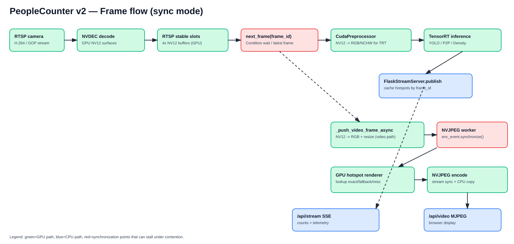
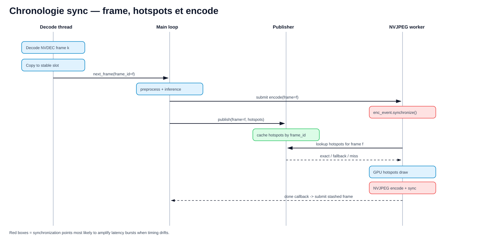
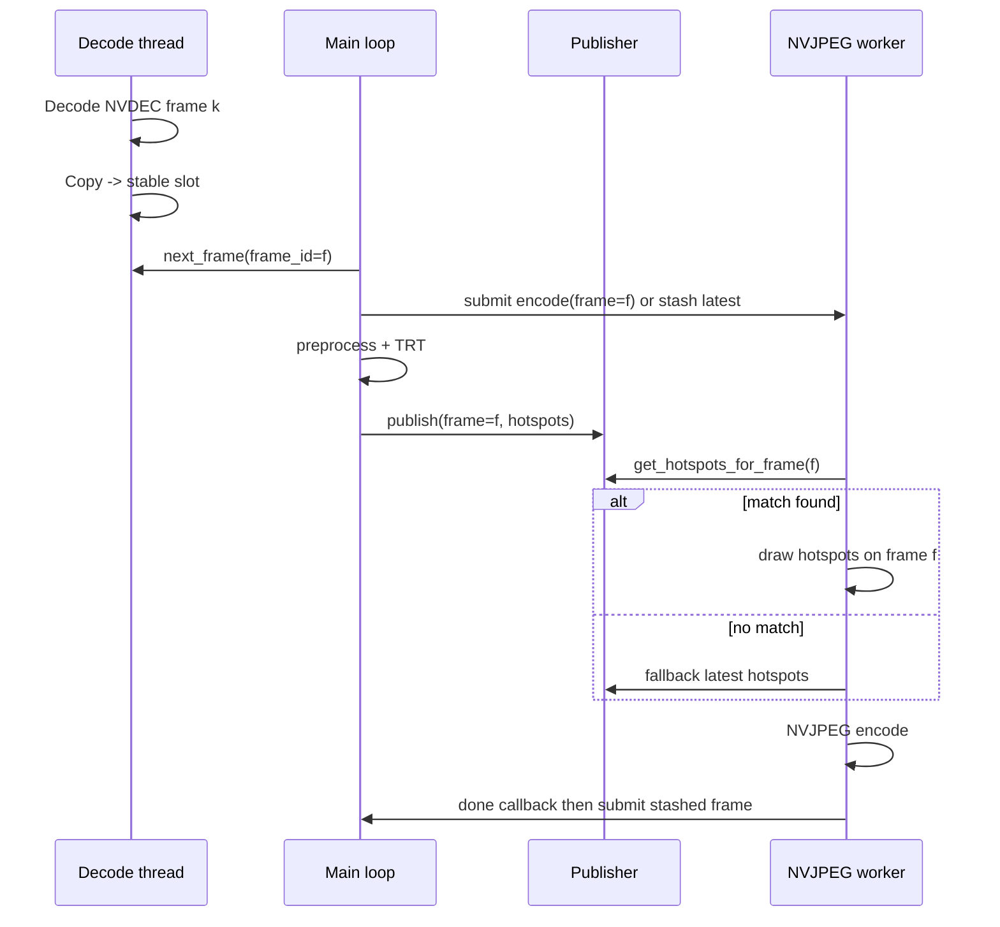

# Frame Flow & Synchronisation — app_v2

Cette page décrit précisément le trajet d’une frame en **mode sync (MJPEG + overlay server-side)**, les buffers utilisés, les points de synchronisation CUDA/threads, et où peuvent apparaître les trous visuels (frame sans points).

## 1) Vue d’ensemble (frame pipeline)

```mermaid
flowchart LR
    cam["📷 Camera / RTSP"] --> nvdec["NVDEC decode<br/>GPU NV12 surface"]
    nvdec --> ring["NVDEC ring<br/>GpuRingBuffer"]
    ring --> copy["RTSPFrameSource decode thread<br/>copy NV12 -> stable slot"]
    copy --> stable["Stable NV12 slots<br/>(4 buffers, GPU)"]
    stable --> next["next_frame(frame_id)<br/>consumer thread"]
    next --> vconv["_push_video_frame_async<br/>NV12->RGB + resize<br/>_video_stream"]
    vconv --> stash["pending frame stash<br/>(latest only)"]
    stash --> encw["nvjpeg worker thread<br/>single executor"]
    encw --> draw["GPU hotspot render<br/>(frame_id lookup)"]
    draw --> nvjpeg["torchvision.encode_jpeg<br/>NVJPEG stream"]
    nvjpeg --> mjpeg["/api/video MJPEG"]

    next --> pre["CudaPreprocessor"]
    pre --> trt["TensorRT model(s)"]
    trt --> pub["FlaskStreamServer.publish<br/>cache hotspots by frame_id"]
    pub --> sse["/api/stream SSE"]
    sse --> ui["Browser UI"]
    mjpeg --> ui
```

### Important — les modèles ont-ils besoin de RGB ?

Oui. Le `GpuFrame` issu de NVDEC est en **NV12**, mais le chemin modèle passe par `CudaPreprocessor`, qui convertit/normalise vers des tenseurs **RGB/NCHW** adaptés aux moteurs TensorRT.

- **Chemin modèle**: `next_frame` -> `CudaPreprocessor` -> TensorRT
- **Chemin vidéo MJPEG**: `next_frame` -> `_push_video_frame_async` -> NV12->RGB resize -> NVJPEG

Donc il y a bien deux conversions/transformations dédiées, pour deux usages différents (inférence vs affichage vidéo).

## 2) Buffers en jeu

### A. Côté source/décodage

- `NvdecDecoder` écrit d’abord dans un ring NVDEC.
- `RTSPFrameSource._decode_loop()` copie ensuite dans des **stable slots NV12** (`_STABLE_SLOT_COUNT = 4`).
- `next_frame()` lit la **dernière frame disponible** (policy low-latency, avec drop implicite des intermédiaires si le consumer est lent).

### B. Côté encode vidéo

- Le chemin vidéo ne bloque pas l’inférence : conversion NV12->RGB sur `_video_stream`.
- Une frame prête à encoder est stockée dans un stash (`_pending_chw`, `_pending_enc_event`, `_pending_frame_id`).
- L’encodeur est mono-worker (`ThreadPoolExecutor(max_workers=1)`) : si occupé, on garde **la plus récente**.

### C. Côté hotspots / points

- `publish(frame_id, payload)` met à jour un cache points/hotspots.
- Le cache inclut maintenant :
  - dernier snapshot (`_hotspots_cache`, `_hotspots_frame_id`),
  - **historique court par `frame_id`** (`_hotspots_history`, limite 8).
- Le worker NVJPEG tente d’abord `get_hotspots_for_frame(frame_id)`, puis fallback latest.

## 3) Chronologie simplifiée (mode sync)

## 4) Où la latence peut se cumuler

Même avec NVJPEG matériel, le coût total encode peut monter selon :

1. **`enc_event.synchronize()`** (attente que la conversion vidéo GPU soit terminée),
2. **render points GPU** (dense scenes),
3. **NVJPEG encode kernel**,
4. **copie du JPEG vers CPU** (`buf.cpu().numpy()`),
5. push MJPEG HTTP.

👉 En pratique, le goulot n’est pas forcément NVJPEG pur : l’attente d’event + copie CPU + contention mémoire GPU peuvent dominer selon la scène.

## 5) Audit des points de synchronisation (où ça peut vraiment ralentir)

Liste des points de synchro/blocking à surveiller en priorité :

1. `RTSPFrameSource.next_frame()`
    - `Condition.wait(timeout=1.0)`
    - impact: `frame_source_wait_latest_ms`

2. `RTSPFrameSource._copy_frame_into_slot()`
    - `_copy_stream.synchronize()` (une fois par frame décodée)
    - impact: `frame_source_copy_sync_ms`

3. `PipelineOrchestrator` en mode `RAW_STREAM_WITH_METADATA`
    - `_video_stream.synchronize()` avant `output.release_all()`
    - impact potentiel sur overlap video/inference

4. Worker NVJPEG
    - `enc_event.synchronize()`
    - `nvjpeg_stream.synchronize()`
    - impact: `video_encode_wait_event_ms`, `video_encode_*`

5. Lookup hotspots avant draw
    - lookup `frame_id` exact puis fallback latest
    - impact désormais traçable via:
      - `video_hotspot_lookup_ms`
      - `video_hotspot_lookup_mode_code` (0 none, 1 exact, 2 fallback, 3 miss)
      - compteurs cumulés `video_hotspot_lookup_exact/fallback/miss`

## 6) Sur l’idée double/triple buffering encodeur

### Déjà présent aujourd’hui

- Côté source: pool de 4 stable slots.
- Côté encode: stash « latest only » (file de profondeur 1 logique).

### Option possible (si on veut lisser davantage)

Passer de « latest only » à une **petite file bornée (2–3 frames)** avec stratégie :
- conserver ordre `frame_id` (FIFO),
- drop explicite si overflow,
- lookup hotspots strict par `frame_id`.

Trade-off :
- + moins de pertes visuelles lors de bursts encode,
- − plus de latence vidéo (car queueing),
- + mémoire GPU temporaire.

## 7) Fichiers clés

- Orchestration: `app_v2/application/pipeline_orchestrator.py`
- Source RTSP/NVDEC: `app_v2/infrastructure/rtsp_frame_source.py`
- Publisher/hotspots: `app_v2/infrastructure/flask_server/server.py`
- Renderer points GPU: `app_v2/kernels/gpu_hotspot_renderer.py`

## 8) Benchmark encodeur NVJPEG 1080p

Un script reproductible est fourni ici :

- `diagnostics/bench_nvjpeg_1080p.py`

Les résultats de référence (mesures Docker archivées) sont ici :

- `app_v2/docs/README_NVJPEG_BENCH.md`
- `app_v2/docs/README_SYNC_POINTS_AUDIT.md`

Il mesure séparément :
- NVJPEG kernel,
- copie CPU du buffer JPEG,
- total encode+copy,
- FPS effectif à différentes qualités JPEG.
