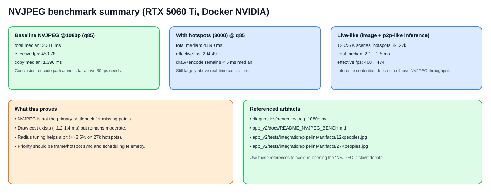

# NVJPEG Benchmark Reference (Docker NVIDIA)

Objectif: garder des mesures reproductibles "sous le coude" pour éviter les faux diagnostics du type *"c'est l'encodeur NVJPEG qui traîne"*.

## Environnement de mesure

- Date: 2026-05-11
- Host GPU: NVIDIA GeForce RTX 5060 Ti
- Container: `people-counter:gpu-final-nvdec`
- CUDA (container): 13.1.1
- Command runner: `./docker_exec.sh`
- Script: `diagnostics/bench_nvjpeg_1080p.py`



---

## Commandes exécutées

### 1) Baseline NVJPEG pur (sans hotspots)

```bash
./docker_exec.sh python3 diagnostics/bench_nvjpeg_1080p.py \
  --width 1920 --height 1080 \
  --warmup 30 --iters 200 \
  --qualities 75,85,95
```

### 2) NVJPEG + hotspots (3000)

```bash
./docker_exec.sh python3 diagnostics/bench_nvjpeg_1080p.py \
  --width 1920 --height 1080 \
  --warmup 30 --iters 200 \
  --qualities 75,85,95 \
  --with-hotspots --hotspots-count 3000
```

### 3) Live-like (image réelle + inférence parallèle + sweep hotspots)

Image 12K:

```bash
./docker_exec.sh python3 diagnostics/bench_nvjpeg_1080p.py \
  --image /app/app_v2/tests/integration/pipeline/artifacts/12kpeoples.jpg \
  --width 1920 --height 1080 \
  --warmup 80 --iters 3000 \
  --qualities 85 \
  --with-hotspots --hotspots-sweep 3000,12000,27000 \
  --simulate-inference
```

Image 27K:

```bash
./docker_exec.sh python3 diagnostics/bench_nvjpeg_1080p.py \
  --image /app/app_v2/tests/integration/pipeline/artifacts/27Kpeoples.jpg \
  --width 1920 --height 1080 \
  --warmup 80 --iters 3000 \
  --qualities 85 \
  --with-hotspots --hotspots-sweep 3000,12000,27000 \
  --simulate-inference
```

### 4) Long run demandé (30 000 images)

```bash
./docker_exec.sh python3 diagnostics/bench_nvjpeg_1080p.py \
  --image /app/app_v2/tests/integration/pipeline/artifacts/12kpeoples.jpg \
  --width 1920 --height 1080 \
  --warmup 100 --iters 30000 \
  --qualities 85 \
  --with-hotspots --hotspots-count 3000 \
  --simulate-inference
```

---

## Résultats

## A) Baseline NVJPEG pur

| quality | kernel_med_ms | copy_med_ms | total_med_ms | fps_eff | jpeg_kb_med |
|---:|---:|---:|---:|---:|---:|
| 75 | 0.706 | 0.413 | 1.118 | 894.20 | 2539.0 |
| 85 | 0.951 | 1.390 | 2.218 | 450.78 | 3201.0 |
| 95 | 0.911 | 2.036 | 2.898 | 345.04 | 4896.2 |

## B) NVJPEG + hotspots (3000)

| quality | kernel_med_ms | copy_med_ms | total_med_ms | fps_eff | jpeg_kb_med |
|---:|---:|---:|---:|---:|---:|
| 75 | 3.703 | 0.433 | 4.242 | 235.72 | 2543.7 |
| 85 | 3.647 | 1.001 | 4.890 | 204.49 | 3207.6 |
| 95 | 3.630 | 1.110 | 5.281 | 189.36 | 4901.0 |

## C) Live-like @ q=85 — image 12K + inférence parallèle

| hotspots | draw_med_ms | infer_med_ms | total_med_ms | fps_eff | total_p95_ms |
|---:|---:|---:|---:|---:|---:|
| 3000  | 1.267 | 1.992 | 2.203 | 453.96 | 3.926 |
| 12000 | 1.408 | 2.000 | 2.462 | 406.11 | 4.103 |
| 27000 | 1.284 | 2.001 | 2.414 | 414.20 | 4.305 |

## D) Live-like @ q=85 — image 27K + inférence parallèle

| hotspots | draw_med_ms | infer_med_ms | total_med_ms | fps_eff | total_p95_ms |
|---:|---:|---:|---:|---:|---:|
| 3000  | 1.158 | 1.947 | 2.108 | 474.28 | 3.494 |
| 12000 | 1.264 | 1.985 | 2.308 | 433.24 | 3.890 |
| 27000 | 1.301 | 1.993 | 2.500 | 400.06 | 4.069 |

## E) Long run 30 000 itérations (12K, q=85, 3000 hotspots, inférence parallèle)

| hotspots | iters | draw_med_ms | infer_med_ms | total_med_ms | total_p95_ms | fps_eff |
|---:|---:|---:|---:|---:|---:|---:|
| 3000 | 30000 | 1.232 | 1.989 | 2.196 | 3.908 | 455.43 |

## F) Tuning draw radius (27K hotspots, image 27K, q=85, inférence parallèle)

| radius_px | hotspots | iters | draw_med_ms | total_med_ms | fps_eff |
|---:|---:|---:|---:|---:|---:|
| 3 | 27000 | 5000 | 1.273 | 2.590 | 386.06 |
| 1 | 27000 | 5000 | 1.226 | 2.503 | 399.51 |

Observation: sur cette charge, réduire le rayon de 3 à 1 apporte un gain mesuré mais modeste (~0.087 ms sur `total_med_ms`, soit ~+3.5% FPS). Le principal goulot observé en live reste donc probablement ailleurs (alignement/scheduling), pas le coût brut NVJPEG.

---

## Lecture rapide / conclusion opérationnelle

1. **NVJPEG 1080p n'est pas le goulot principal** sur cette plateforme:
   - même en scénario live-like (draw + inférence parallèle), on reste autour de **400–455 fps théoriques** à q=85.
2. Le coût draw hotspots est réel (~1.2–1.4 ms médiane), mais loin d'expliquer à lui seul des trous visuels périodiques à 30 fps.
3. Les "images sans points" observées en live sont donc plus probablement liées à:
   - l'alignement `frame_id` ↔ hotspots,
   - des effets de scheduling/queueing sur le pipeline global,
   - ou des transitions fallback/miss côté lookup hotspots.

Prochaine étape recommandée: exposer une télémétrie explicite `hotspot_lookup_exact / fallback_latest / miss` pour corréler directement les trous visuels avec le chemin de lookup.
