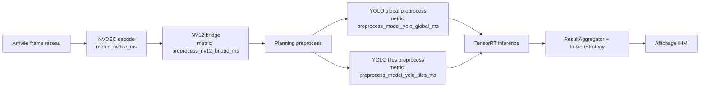
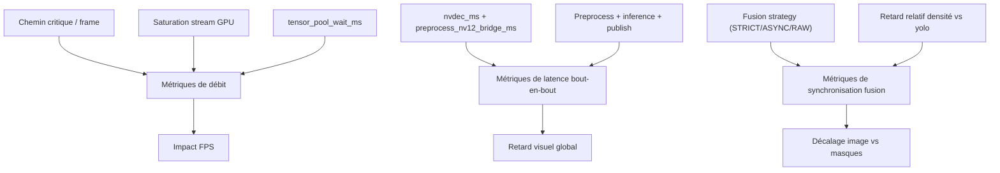
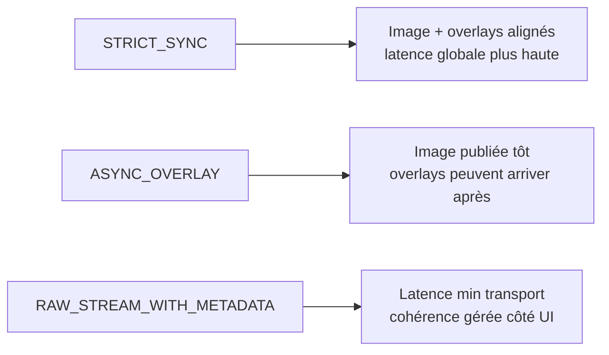

# Analyse performance v2 (FPS, retard, lag overlay)

Ce document sert de guide de lecture des métriques runtime pour distinguer:

- ce qui **limite le FPS** (débit),
- ce qui crée un **retard visuel global** (latence bout-en-bout),
- ce qui crée un **décalage entre image et masques** (lag overlay).

## 1) Où se placent les métriques dans le pipeline

## 2) Séries vs parallélisme (ce qui s’additionne, ce qui non)

### Étapes plutôt sérielles (sur le chemin critique)

- `nvdec_ms`
- `preprocess_nv12_bridge_ms`

Ces deux métriques décrivent le coût avant que la frame soit prête au preprocess modèle. Oui: dans une lecture simplifiée par frame, elles s’additionnent sur la latence de préparation.

### Étapes parallélisables

- `preprocess_model_yolo_global_ms`
- `preprocess_model_yolo_tiles_ms`

Quand elles tournent sur des streams différents, l’impact principal sur le chemin critique est proche de:

- `max(global, tiles)` plutôt que `global + tiles`.

## 3) Lecture pratique: FPS vs retard utilisateur

## 4) Réponse à la question “30.45ms NVDEC = retard fixe ?”

En première approximation: **oui, c’est plutôt un offset de pipeline** (retard quasi fixe), tant que le pipeline reste stable et non saturé.

- `nvdec_ms ~ 30.45` + `preprocess_nv12_bridge_ms ~ 11.97` donne environ **42ms** de délai en amont.
- Visuellement, cela ressemble à un retard presque constant entre scène réelle et image exploitable par l’IA.

Ce retard devient variable si:

- la source réseau jitter fortement,
- les queues se remplissent,
- un stage dépasse durablement le budget et crée de la congestion.

## 5) Effet de la stratégie de fusion sur la sensation utilisateur

## 6) Timeline simplifiée (exemple mental)

```mermaid
gantt
    title Chronologie d'une frame (schéma simplifié)
    dateFormat  X
    axisFormat %L

    section Préparation frame
    NVDEC (nvdec_ms) :a1, 0, 30
    NV12->RGB bridge (preprocess_nv12_bridge_ms) :a2, 30, 12

    section Préprocess modèle (parallèle)
    YOLO global preprocess :b1, 42, 4
    YOLO tiles preprocess :b2, 42, 4

    section Downstream
    TensorRT infer + post + fusion + publish :c1, 46, 20
```

## 7) Heuristique rapide pour pilotage perf

- **FPS**: dépend du coût du chemin critique par frame (et des recouvrements possibles).
- **Retard global caméra→IHM**: somme des étapes sérielles + attente queues.
- **Lag image vs masques**: dépend surtout de la stratégie de fusion et du retard relatif entre branches modèles.

## 8) Métriques à suivre en priorité

- `nvdec_ms`
- `preprocess_nv12_bridge_ms`
- `preprocess_ms`
- `preprocess_model_yolo_global_ms`
- `preprocess_model_yolo_tiles_ms`
- `preprocess_model_sum_ms`
- `preprocess_model_max_ms`
- `preprocess_critical_path_ms`
- `preprocess_serial_overhead_ms`
- `preprocess_parallel_efficiency`
- `preprocess_stream_model_yolo_global`
- `preprocess_stream_model_yolo_tiles`
- `tensor_pool_wait_ms`
- (à ajouter ensuite) `inference_*_ms`, `publish_ms`, `fusion_wait_ms`

## 9) Interprétation rapide des nouvelles métriques preprocess

- `preprocess_model_sum_ms`: somme des branches preprocess modèle.
- `preprocess_model_max_ms`: branche dominante (borne basse du chemin critique preprocess modèle).
- `preprocess_critical_path_ms`: approximation du chemin critique preprocess (`bridge + max(modèles)`).
- `preprocess_serial_overhead_ms`: coût résiduel (synchronisations/overhead CPU) = `preprocess_ms - preprocess_critical_path_ms`.
- `preprocess_parallel_efficiency`: ratio `sum/max`; plus il grimpe, plus le risque de sérialisation cachée augmente.

Les clés `preprocess_stream_model_*` permettent de vérifier que les branches sont bien routées sur des streams logiques distincts.
