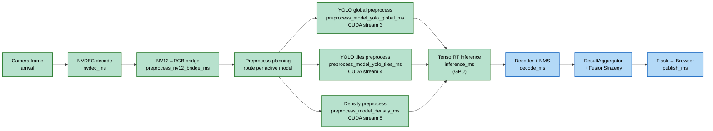
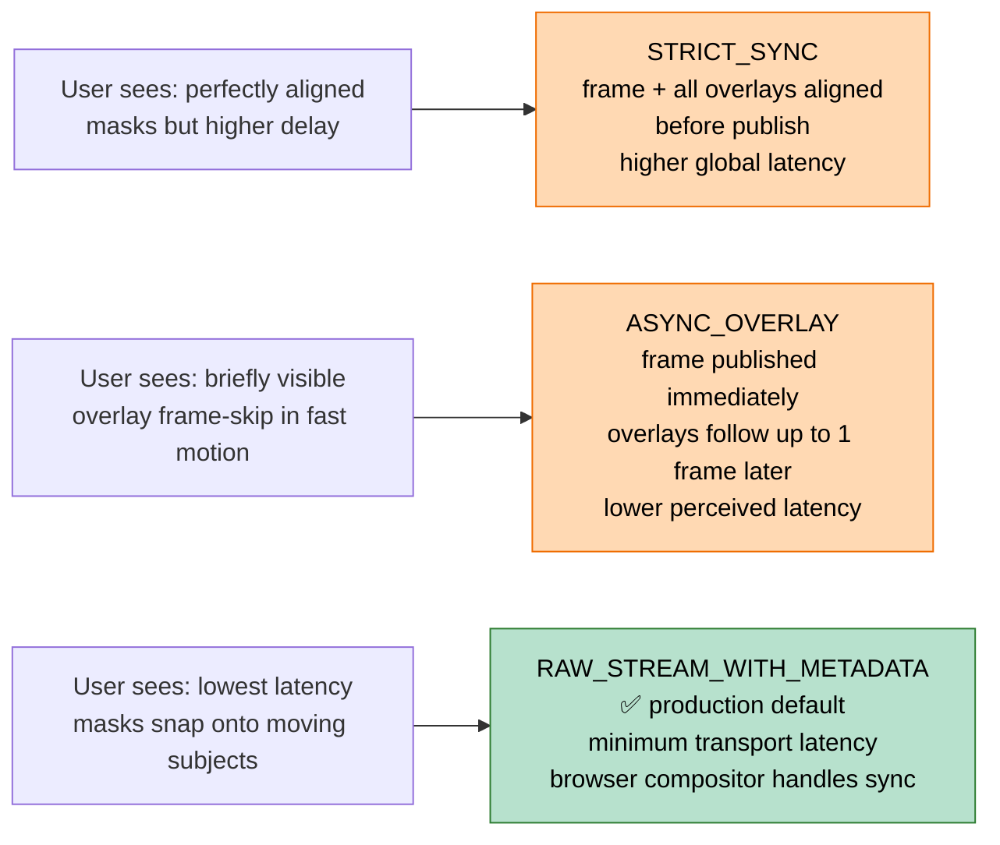

# Performance Analysis — app_v2

> **Hardware**: RTX 5060 Ti (Blackwell sm_120, 16 GB GDDR7, 448 GB/s)  
> **Stack**: CUDA 13.1 · TensorRT 10.15.1 · PyTorch 2.9.1 · OpenCV 4.13  
> **Source**: 4K / 1080p camera stream

This document explains how to read and interpret runtime metrics to diagnose:

- what **limits FPS** (throughput bottleneck),
- what creates **global visual latency** (end-to-end delay camera → screen),
- what creates **overlay lag** (desynchronisation between video and AI overlays).

---

## 1. Pipeline Stage Map


```mermaid
flowchart LR
    NetIn["Camera frame<br/>arrival"]:::gpu
    Nvdec["NVDEC decode<br/>nvdec_ms"]:::gpu
    Bridge["NV12→RGB bridge<br/>preprocess_nv12_bridge_ms"]:::gpu
    Plan["Preprocess planning<br/>route per active model"]:::gpu
    G["YOLO global preprocess<br/>preprocess_model_yolo_global_ms<br/>CUDA stream 3"]:::gpu
    T["YOLO tiles preprocess<br/>preprocess_model_yolo_tiles_ms<br/>CUDA stream 4"]:::gpu
    D["Density preprocess<br/>preprocess_model_density_ms<br/>CUDA stream 5"]:::gpu
    Inf["TensorRT inference<br/>inference_ms<br/>(GPU)"]:::gpu
    Dec["Decoder + NMS<br/>decode_ms"]:::cpu
    Agg["ResultAggregator<br/>+ FusionStrategy"]:::cpu
    UI["Flask → Browser<br/>publish_ms"]:::cpu

    NetIn --> Nvdec --> Bridge --> Plan
    Plan --> G --> Inf
    Plan --> T --> Inf
    Plan --> D --> Inf
    Inf --> Dec --> Agg --> UI

    classDef gpu fill:#b7e1cd,color:#000,stroke:#2e7d32,stroke-width:1.5px;
    classDef cpu fill:#b3d9f7,color:#000,stroke:#1565c0,stroke-width:1.5px;
```

---

## 2. Serial vs Parallel Stages

### Serial stages (on the critical path — they add up)

| Stage | Metric | Typical value | Notes |
|-------|--------|--------------|-------|
| NVDEC hardware decode | `nvdec_ms` | ~1-3 ms | Fixed pipeline offset — GPU hardware |
| NV12→RGB CUDA bridge | `preprocess_nv12_bridge_ms` | ~2-4 ms | D2D copy + format conversion |
| **Preparation subtotal** | — | **~4 ms** | Unavoidable before any model can run |

> These 42 ms represent a near-constant pipeline offset: the image is already
> ~42 ms old by the time any AI model sees it.

### Parallel stages (overlap on separate CUDA streams)

| Stage | Metric | Typical value |
|-------|--------|--------------|
| YOLO global preprocess | `preprocess_model_yolo_global_ms` | ~3–4 ms |
| YOLO tiles preprocess | `preprocess_model_yolo_tiles_ms` | ~4 ms |
| Density preprocess | `preprocess_model_density_ms` | ~3 ms |

When running on separate CUDA streams the critical path contribution is:

```
preprocess_critical_path_ms ≈ bridge_ms + max(active_model_preprocess_ms)
```

Not `bridge + sum(all)`.

---

## 3. Inference Benchmarks by Mode

### YOLO models — RTX 5060 Ti, 4K source

| Mode | Model | Decoder | Precision | Inference | Notes |
|------|-------|---------|-----------|----------|-------|
| `yolo_global` | yolo26x | YOLOv8 | FP8-QDQ | ~3–5 ms | FP16 baseline was ~6.3 ms; FP8-QDQ ~2× gain |
| `yolo_tiles` | yolo26n | YOLOv8 | FP8-QDQ | ~10–15 ms | FP16 baseline was ~33 ms; FP8-QDQ targets ≤10 ms |
| `yolo_tiles` (FP16, parallel ×2) | yolo26n | YOLOv8 | FP16 | ~22 ms | 30% gain over FP16 baseline (Python GIL limits ×4+) |
| `crowd_global` | YOLO-CROWD | YOLOv5 | FP16 | ~6–10 ms | nc=1, 100 800 anchors/tile — no FP8 yet |
| `crowd_tiles` | YOLO-CROWD | YOLOv5 | FP16 | ~20–30 ms | 6 tiles + cross-tile NMS |

> **Model naming note**: inference models are **yolo26** (v26 family). The decoder
> is `yolo_v8_decoder` because it handles the YOLOv8-compatible output tensor format,
> which is also produced by yolo26 and YOLO11 models.
>
> FP8-QDQ engines (`yolo26x-seg-fp8-qdq.engine`, `yolo26n-fp8-qdq.engine`) are
> the **production engines** since March 2026.

### Density model — DM-Count QNRF (VGG16 backbone)

> **Key insight**: DM-Count (VGG16) is **memory-bandwidth bound**.
> Latency scales linearly with total pixel count, regardless of tiling or batch size.
> All configurations that process ~8.3 MP take ~92 ms on this GPU — no parallelism benefit.

| Configuration | Engine | Precision | Latency | Coverage | Status |
|--------------|--------|-----------|--------:|---------|--------|
| Resize 4K → 1920×1088, batch=1 | b1 engine | FP16 | **22.9 ms** | 100% | ✅ **production** |
| Resize 4K → 1920×1088, batch=1 | b1 engine | FP8-QDQ | **21.8 ms** | 100% | ~5% gain — marginal |
| 2×2 native tiles, batch=4 | 1920×1088 engine | FP16 | 92 ms | 100% native | too slow |
| 6×3 tiles 640×720, batch=18 | 640×720 engine | FP16 | 92 ms | 100% rescaled | too slow |
| 4K native, batch=1 | 3840×2160 engine | FP16 | 97 ms | 100% native | too slow |
| Partial 4 tiles 640×720, batch=4 | 640×720 engine | FP16 | ~20 ms | ~14% (ROI) | for zone-focus |

```
Total pixels → Latency (FP16, RTX 5060 Ti)
─────────────────────────────────────────────────
  460 800 px  (b=1 × 640×720)        →   5.2 ms  🟢
2 088 960 px  (b=1 × 1920×1088)      →  22.9 ms  🟢 ≤33 ms ✅  ← production
3 110 400 px  (b=6 × 640×720)        →  31   ms  🟡 ≤33 ms ✅
8 294 400 px  (b=18 × 640×720,
               b=4 × 1920×1088,
               b=1 × 3840×2160)      →  92–97 ms  🔴 too slow
─────────────────────────────────────────────────
```

---

## 4. End-to-End Latency Budget (4K@30fps target)


```mermaid
gantt
    title Frame lifecycle — approximate timings (GPU=green, CPU=blue)
    dateFormat  X
    axisFormat %Lms

    section Fixed overhead (GPU)
    NVDEC decode          :a1, 0, 30
    NV12 to RGB bridge    :a2, 30, 12

    section Preprocess (parallel CUDA streams, GPU)
    YOLO global preprocess :b1, 42, 4
    YOLO tiles preprocess  :b2, 42, 4
    Density preprocess     :b3, 42, 3

    section Inference (GPU — TensorRT)
    yolo_global FP8-QDQ   :c1, 46, 5
    yolo_tiles FP8-QDQ    :c2, 46, 15
    density FP16          :c3, 46, 23

    section Decode + publish (CPU)
    Decoder NMS + publish  :d1, 69, 8
```

| Budget item | Time | Target |
|-------------|------|--------|
| NVDEC + NV12 bridge (serial) | ~3 ms | fixed overhead |
| Preprocess (critical path) | ~4 ms | — |
| TensorRT inference | 5–23 ms | ≤15 ms |
| Decode NMS + publish | ~5–8 ms | — |
| **Total end-to-end** | **~12-40 ms FP16** | **≤33 ms** |
| **With FP8-QDQ YOLO** | **~12-33 ms** | improving |


---

## 5. Effect of Fusion Strategy on User Experience


```mermaid
flowchart LR
    Strict["STRICT_SYNC<br/>frame + all overlays aligned<br/>before publish<br/>higher global latency"]:::note
    Async["ASYNC_OVERLAY<br/>frame published immediately<br/>overlays follow up to 1 frame later<br/>lower perceived latency"]:::note
    Raw["RAW_STREAM_WITH_METADATA<br/>✅ production default<br/>minimum transport latency<br/>browser compositor handles sync"]:::prod

    s1["User sees: perfectly aligned<br/>masks but higher delay"] --> Strict
    s2["User sees: briefly visible<br/>overlay frame-skip in fast motion"] --> Async
    s3["User sees: lowest latency<br/>masks snap onto moving subjects"] --> Raw

    classDef prod fill:#b7e1cd,color:#000,stroke:#2e7d32;
    classDef note fill:#ffd9b3,color:#000,stroke:#ef6c00;
```

> **Note**: STRICT_SYNC and ASYNC_OVERLAY are implemented in code but have **not
> been validated or tested** end-to-end. Only `RAW_STREAM_WITH_METADATA` has been
> verified in production.

---

## 6. Metrics Reference

### Preprocessing metrics (FrameTelemetry)

| Metric | Description |
|--------|-------------|
| `nvdec_ms` | NVDEC hardware decode time |
| `preprocess_nv12_bridge_ms` | NV12→RGB memcopy + format conversion |
| `preprocess_ms` | Total preprocessing wall-clock |
| `preprocess_model_<name>_ms` | Per-model branch preprocess time |
| `preprocess_kernel_<name>_<idx>_ms` | Individual kernel call timing |
| `preprocess_model_sum_ms` | Sum of all active branch times |
| `preprocess_model_max_ms` | Dominant branch (lower bound of critical path) |
| `preprocess_critical_path_ms` | Approx critical path: `bridge + max(branches)` |
| `preprocess_serial_overhead_ms` | CPU sync overhead: `preprocess_ms - critical_path_ms` |
| `preprocess_parallel_efficiency` | `sum / max` ratio — high values = growing serialisation risk |
| `preprocess_stream_model_<name>` | CUDA stream ID used per branch |

### Tensor pool metrics

| Metric | Description |
|--------|-------------|
| `tensor_pool_hits` | Reused tensors (cache hit) |
| `tensor_pool_misses` | New allocations needed |
| `tensor_pool_allocations` | Total allocations since start |
| `tensor_pool_in_use` | Tensors currently held by active models |
| `tensor_pool_available` | Tensors available for immediate reuse |
| `tensor_pool_waits` | Times the pool blocked (saturation events) |
| `tensor_pool_wait_ms` | Total blocking wait time |

### Inference + downstream metrics (planned / partial)

| Metric | Description |
|--------|-------------|
| `inference_<model>_ms` | TensorRT execution context time per model |
| `decode_<model>_ms` | Decoder NMS + mask decode time |
| `publish_ms` | Flask SSE publish time |
| `fusion_wait_ms` | ResultAggregator wait for all branches |

---

## 7. Diagnosing Performance Issues

### FPS too low
1. Check `tensor_pool_wait_ms` — pool saturation will serialise frames.
2. Check `preprocess_serial_overhead_ms` — high values mean CUDA stream sync issues.
3. Check `inference_yolo_tiles_ms` — tiles are the most expensive YOLO operation.

### High visual latency (camera → screen delay)
1. `nvdec_ms + preprocess_nv12_bridge_ms` — fixed ~42 ms pipeline offset.
2. Check queue depth — if upstream stages back up, this multiplies.

### Overlay lag (video ahead of AI marks)
1. Check active `FusionStrategy` — `STRICT_SYNC` fixes this at the cost of global latency.
2. Check `fusion_wait_ms` — long waits mean one model branch is much slower than others.
3. In `RAW_STREAM_WITH_METADATA` mode: the browser compositor can introduce up to 1 frame of visual lag.

---

## 8. Parallel Tile Split — Diminishing Returns

The `yolo_tiles_parallel` setting splits the tile batch across threads. Observed behaviour:

| Groups | `yolo_tiles` latency | Result |
|--------|---------------------|--------|
| 1 (disabled) | ~33 ms | FP16 baseline |
| 2 | ~22 ms | ✅ 30% gain — maximum benefit |
| 4 | ~28 ms | ❌ regression |
| 8 | ~54 ms | ❌❌ worse than baseline |

**Root cause**: Python GIL + GPU memory contention + batch fragmentation.
**Recommendation**: Use `groups: 2` maximum. The FP8-QDQ engine (production) makes this less necessary.
