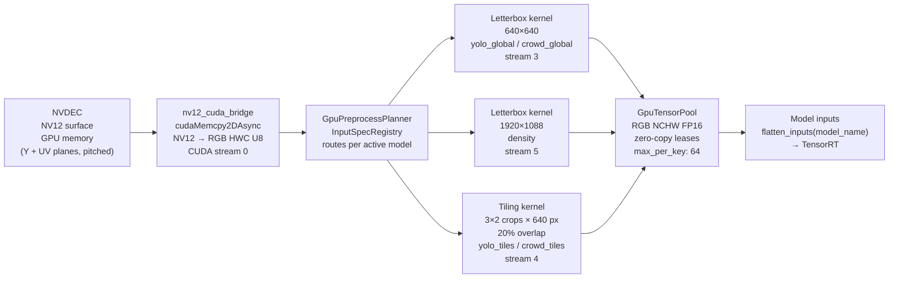
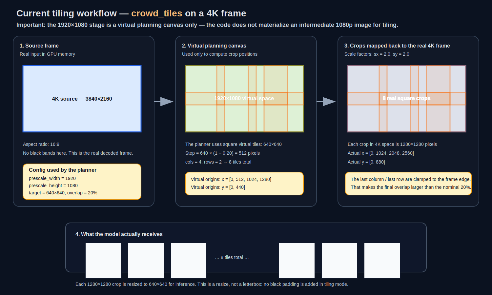
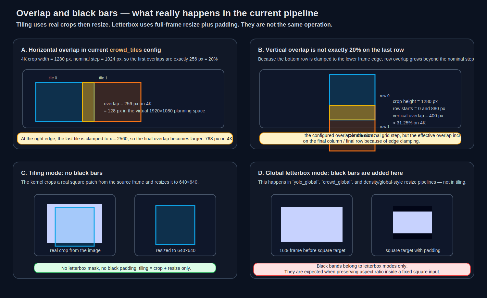

# GPU Preprocessing — app_v2

## Goal

Maintain a **100% GPU preprocessing pipeline** between NVDEC and TensorRT:
zero CPU copies, memory reuse via `GpuTensorPool`, per-model routing, and
per-stage telemetry.

---

## What Happens After NVDEC



### Step by step

1. **NVDEC** delivers NV12 surfaces in GPU memory (Y plane + UV plane, pitched layout).
2. **nv12_cuda_bridge** copies planes device-to-device (`cudaMemcpy2DAsync`) and converts to RGB HWC U8 on the GPU — no CPU involvement.
3. **GpuPreprocessPlanner** (via `InputSpecRegistry`) determines which preprocess branches are active for the current inference mode.
4. **Kernels** run on dedicated CUDA streams:
   - *Letterbox*: resize-with-padding preserving aspect ratio → target resolution.
   - *Tiling*: extract overlapping crops, scale each crop to 640×640.
5. Output tensors (RGB NCHW FP16) are leased from **GpuTensorPool** — no new allocations per frame when the pool is warm.
6. Inputs are routed to TensorRT via `flatten_inputs(model_name)`.
7. Pool leases are released after the result is published (deferred per-frame release).

---

## Preprocess Modes per Model

| Model | Strategy | Target size | Overlap | CUDA stream |
|-------|----------|------------|---------|-------------|
| `yolo_global` | Letterbox | 640×640 | — | 3 |
| `yolo_tiles` | Tiling | 640×640 per tile | 20% | 4 |
| `density` | Letterbox | 1920×1088 | — | 5 |
| `crowd_global` | Letterbox | 640×640 | — | 3 |
| `crowd_tiles` | Tiling | 640×640 per tile | 20% | 4 |

### Letterbox vs Tiling

- **Letterbox**: resize the full frame into the target dimensions while preserving aspect ratio (adds grey padding). Used for single-pass global inference. No spatial information is lost.
- **Tiling**: extract overlapping crops from the frame, each scaled to 640×640. Used for high-resolution scenes where small objects would be undetectable in a downscaled global view.
  - **Important**: in the current code, `prescale_width` / `prescale_height` define a **virtual planning canvas**. The pipeline does **not** first build a real 1920×1080 RGB image and then tile it.
  - **Current `crowd_tiles` config on a 4K source**: the planner computes tiles on a virtual `1920×1080` canvas, then maps those coordinates back to the real `3840×2160` frame.
  - **20% overlap** is the **nominal step reduction** used to place tiles. Because the last column / last row are clamped to the frame edge, the **effective overlap becomes larger** on those boundaries.

### Detailed example — current `crowd_tiles` geometry on a 4K source



Configuration used by the planner:

```yaml
preprocess:
  crowd_tiles:
    target_width: 640
    target_height: 640
    mode: tiles
    overlap: 0.2
    prescale_width: 1920
    prescale_height: 1080
```

This means:

1. Build the tile grid on a **virtual** `1920×1080` canvas.
2. Use square virtual tiles of `640×640`.
3. Apply the overlap via the placement step:

$$
step = 640 \times (1 - 0.2) = 512
$$

4. Compute the grid size:

$$
cols = \left\lceil \frac{1920 - 640}{512} \right\rceil + 1 = 4
$$

$$
rows = \left\lceil \frac{1080 - 640}{512} \right\rceil + 1 = 2
$$

So the current planner generates **4×2 = 8 tiles**, not 6.

Virtual tile origins:

- `x = [0, 512, 1024, 1280]`
- `y = [0, 440]`

Those coordinates are then mapped back to the real 4K frame with:

$$
s_x = 3840 / 1920 = 2.0, \qquad s_y = 2160 / 1080 = 2.0
$$

So each real crop becomes:

- crop size: **1280×1280** pixels
- `x = [0, 1024, 2048, 2560]`
- `y = [0, 880]`

Each of those 8 square crops is then resized to the model input size `640×640`.

### Overlap: where it is uniform, and where it grows



For the first neighbouring tiles, the overlap matches the configured value:

- horizontal overlap: `1280 - 1024 = 256 px` on the real 4K frame = **20%** of a 1280-px crop

But because the final tiles are clamped to the frame borders, the effective overlap is larger at the edges:

- last horizontal pair: tile starts at `2048` and `2560` → overlap = `2048 + 1280 - 2560 = 768 px`
- vertical pair: row starts at `0` and `880` → overlap = `1280 - 880 = 400 px` ≈ **31.25%**

So the practical rule is:

- **inside the grid**: overlap follows the configured 20% step logic,
- **on the last column / last row**: overlap increases because the planner clamps the final tile to the image edge.

### Tiling pre-scale

`crowd_tiles` currently uses a virtual `prescale_width: 1920 / prescale_height: 1080` to compute the tile grid. This makes the tile layout resolution-independent without materializing a real 1080p intermediate image:

| Source | Crop in source | Scale to tile |
|--------|---------------|---------------|
| 1920×1080 | 640×640 | 1:1 (no resize) |
| 2560×1440 | 853×853 | 0.75× |
| 3840×2160 | 1280×1280 | 0.5× |

### Black bands: only in letterbox modes, not in tiling

The tiling kernels do **not** add black bars. They:

1. crop a real rectangular / square region from the source frame,
2. resize that crop to the target size.

There is **no letterbox mask** in tiling mode.

Black padding appears only in **letterbox** paths such as:

- `yolo_global`
- `crowd_global`
- `density` when using a full-frame aspect-preserving letterbox-style resize

### Current config nuance: `yolo_tiles` vs `crowd_tiles`

The current YAML is **not symmetrical**:

- `crowd_tiles` has `prescale_width/prescale_height`, so its tile layout is computed on a virtual `1920×1080` canvas.
- `yolo_tiles` currently has **no** `prescale_width/prescale_height`, so on a raw `3840×2160` frame with `overlap: 0.2` it produces a denser grid: **8×4 = 32 tiles** of `640×640` source crops.

If you want both tiled modes to share the exact same grid geometry, that must be configured explicitly.

---

## GpuTensorPool

The pool manages a fixed set of GPU tensor buffers keyed by `(shape, dtype, format, stream, device)`.

- **Lease**: a model acquires a tensor at preprocessing, holds it through inference, releases after publish.
- **Blocking saturation policy**: if all tensors for a key are in use, the caller blocks until one is released (prevents OOM under back-pressure).

### Configuration (`pipeline.yaml`)

```yaml
tensor_pool:
  max_per_key: 64   # max tensors per (shape, dtype, format, stream, device) key
                    # Recommended: 64 for 4K@30fps with YOLO global + tiles
                    # (16 GB GDDR7 — each 640×640 FP16 tensor ≈ 0.8 MB)
```

### Pool metrics

| Metric | What it tells you |
|--------|------------------|
| `tensor_pool_hits` | Reused tensors (healthy — no allocation overhead) |
| `tensor_pool_misses` | New allocations needed (normal on warm-up) |
| `tensor_pool_in_use` | Leases currently held |
| `tensor_pool_available` | Tensors ready for immediate reuse |
| `tensor_pool_waits` | Saturation events (pool exhausted — increase `max_per_key`) |
| `tensor_pool_wait_ms` | Total blocking time (directly impacts FPS) |

---

## Preprocess Telemetry Metrics

All timings are recorded in `FrameTelemetry` and streamed to the UI via SSE.

### Timing breakdown

| Metric | Description |
|--------|-------------|
| `nvdec_ms` | NVDEC hardware decode time |
| `preprocess_nv12_bridge_ms` | NV12→RGB copy + conversion |
| `preprocess_ms` | Total preprocessing wall-clock |
| `preprocess_model_<name>_ms` | Per-model branch time |
| `preprocess_kernel_<name>_<idx>_ms` | Individual kernel call |

### Derived analysis metrics

| Metric | Formula | Interpretation |
|--------|---------|---------------|
| `preprocess_model_sum_ms` | sum of active branches | total "work" scheduled |
| `preprocess_model_max_ms` | max of active branches | dominant branch — lower bound of critical path |
| `preprocess_critical_path_ms` | `bridge + max(branches)` | tightest serial estimate |
| `preprocess_serial_overhead_ms` | `preprocess_ms - critical_path_ms` | CPU sync + scheduling overhead |
| `preprocess_parallel_efficiency` | `sum / max` | >2 = risk of hidden serialisation |
| `preprocess_stream_model_<name>` | CUDA stream ID per branch | verify separate stream routing |

---

## Integration Test

The canonical preprocess performance test is:

```
app_v2/tests/integration/pipeline/test_pipeline_metrics_integration.py
```

Run it to capture a baseline after any preprocess changes:

```bash
./5_run_tests.sh -k test_pipeline_metrics
```

---

## Future Work

| Item | Status |
|------|--------|
| Fused NV12→RGB + letterbox in a single custom CUDA kernel (eliminate one memory pass) | ⏳ deferred |
| Auto-tuner for `max_per_key` pool sizing based on observed throughput | ⏳ deferred |
