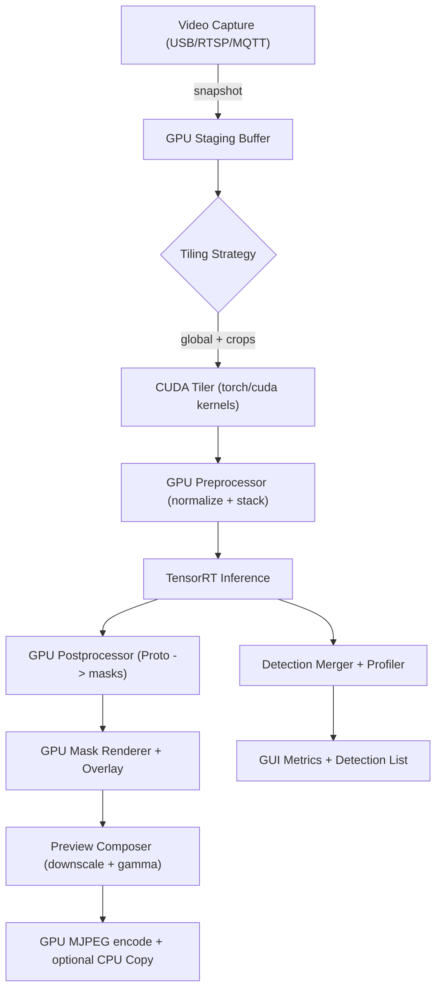

# Full CUDA Pipeline Plan

## Goal & Constraints
- [ ] Capture the existing video stream into GPU memory (via CUDA-friendly capture path), avoiding redundant CPU copies.
- [ ] Keep tiling, resizing, and normalization inside CUDA so each tile feeds TensorRT without leaving the device.
- [ ] Blend masks, overlay diagnostics, and produce a downscaled preview entirely on CUDA; transfer only the final frame (if needed) to the CPU/GUI.
- [ ] Expose fused detections (boxes + masks) so the UI receives a single merged result.
- [ ] Maintain clear SOLID boundaries; place CUDA-specific helpers under `cuda_pipeline/` without breaking existing CPU codepaths.

## Architecture Sketch

## Milestones & Tasks

### 1. Capture & Staging
- [x] Evaluate current capture modules and define a GPU-friendly staging interface (e.g., `GpuFrameReceiver`).
- [x] Implement a wrapper that copies the RGB image into a CUDA tensor once per frame (consider leveraging pinned host memory if direct capture not available).
- [x] Make the new staging buffer reusable by both CPU and GPU pipelines.

### 2. CUDA Tiling Layer
- [x] Design `cuda_pipeline/tiler.py` with a tiling strategy that creates tensors of shape `(3, 640, 640)` from the full-resolution GPU frame.
- [x] Provide metadata (tile coordinates + scale factors) so downstream fusion still works without extra copies.
- [x] Ensure the tiler can also emit the global anchor tile.

### 3. Testing & Verification Helpers
- [x] Add a lightweight helper to run arbitrary commands inside `people-counter:gpu-final` so CUDA experiments can be launched without modifying the main launcher.

### 3. GPU Preprocessor & Inference Path
- [x] Introduce `cuda_pipeline/preprocessor.py` that accepts tensors from the tiler, normalizes them, and batches them for TensorRT.
- [x] Reuse `YoloTensorRTEngine`’s `set_preprocessor_mode` to hook into this path when `gpu_full` is active.
- [x] Guard the existing CPU path so no regressions occur when CUDA is unavailable.
#### Notes
- `YoloSegPeopleCounter.configure_pipeline` now forces the TensorRT engine into GPU preprocessing when the effective pipeline is `gpu`/`gpu_full`, and the helper only registers when CUDA is available so CPU builds stay untouched.

### 4. GPU Postprocessing & Renderer
- [x] Refactor `cuda_pipeline/postprocessor.py` to compute masks from prototypes directly on CUDA (reusing Torch/CuPy ops).
- [x] Update `GpuMaskRenderer` (or add `CudaMaskRenderer`) to blend the mask onto the full-resolution tensor and create a downscaled preview tensor.
- [x] Produce fused detection outputs (clusters + masks) in GPU memory but still convert final mask list to CPU/numpy only when needed by non-GPU consumers.
#### Notes
- `CudaMaskPostprocessor` now rebuilds mask fragments on CUDA before passing them to the renderer, and `GpuMaskRenderer`/`CpuMaskRenderer` accept torch tensors so GPU output never shrinks before the overlay is composed.

### 5. Preview, Encoding & GUI Handoff
- [x] Create `cuda_pipeline/preview.py` that resizes the overlayed tensor to the GUI-friendly resolution on CUDA, then encodes directly to MJPEG (NVENC or CUDA-friendly ffmpeg wrapper) before optionally copying the final frame to the CPU.
- [ ] Emit metrics & detection data from the CUDA path (list of clusters + mask outlines) without additional copies.
- [x] Update `camera_app_pipeline.py` + web server to handle CUDA outputs while preserving existing metrics.

#### Notes
- The CUDA preview composer now letterboxes the GPU overlay to the GUI window size, encodes it to MJPEG, and feeds that payload through the shared `frame_callback` so the web server can stream the GPU frame without re-encoding.

### 6. Integration & Fallbacks
- [ ] Wire the new `gpu_full` path under a `CudaPipelineController`, ensuring `auto`/`gpu` modes remain available.
- [x] Add instrumentation/logging to confirm we never revisit the CPU tiler when `gpu_full` is engaged.
- [ ] Provide helper tests or manual checks verifying the GPU-only path executes end-to-end.
 
### Validation Notes
- GPU metrics now report `[DEBUG] YOLO pipeline report: {'requested_mode': 'gpu_full', 'active_mode': 'gpu_full', 'helpers_available': True, 'last_gpu_full_success': True}` and CPU usage ~14–33%, proving the tiler/report instrumentation works.

### 7. Cleanup & Documentation
- [ ] Document the new pipeline layout, required dependencies (torch/cuda), and how to use the UI toggle for the full path.
- [ ] Update the README/metrics dashboard to show the new `yolo_pipeline_mode_effective` values and explain the GPU staging layer.
- [ ] Remove this plan once the full CUDA pipeline is merged (per your request).

## Tracking Notes
- Current plan file: `cuda_pipeline_plan.md` (delete once complete).
- Follow the flowchart above when mapping code changes.
- Maintain GPU resource hygiene (free intermediates, avoid pinning leaks).
