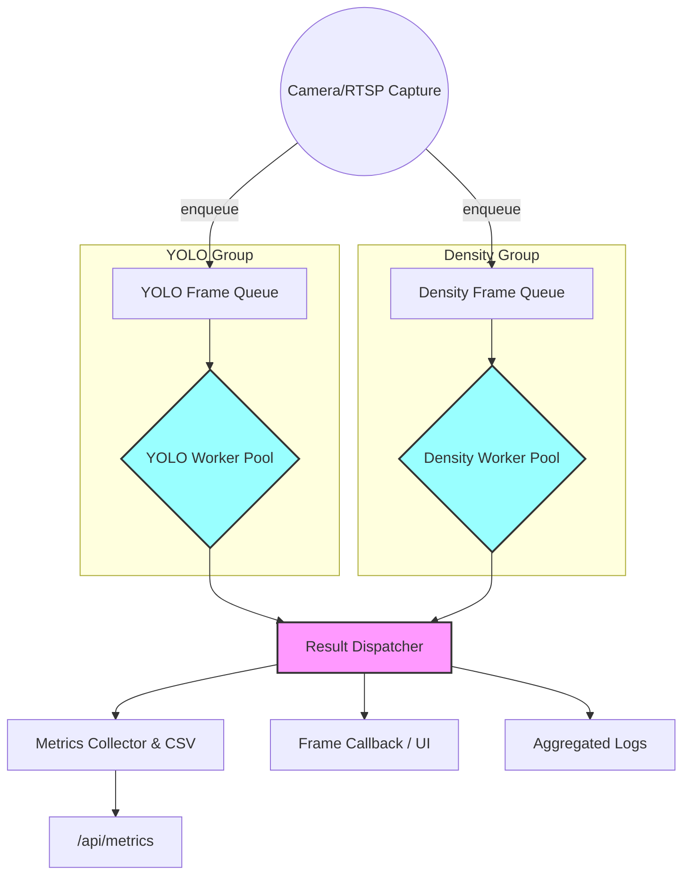

# Action Plan: Multi-Frame Inference Flow (EPIC)

## TL;DR
1. Keep `camera_app_pipeline.py` lean by offloading frame bookkeeping to the new `frame_tasks` helpers and the split `pipeline_components` modules (`ProfileManager`, `ModelLoader`, `MetricsCollector`).
2. YOLO/Density work now flows through `WorkerPool`s that tag frames, respect queue bounds, and feed results back to the capture loop.
3. Surface queue-depth metrics and warnings so the UI and logs stay consistent while the GPU runs at capacity.

## Architecture Overview

Current runtime now drives YOLO/density via the `WorkerPool`-backed path in `camera_app_pipeline.py`; the diagram above remains the long-term distributed dispatcher layout once per-group result handling grows further.

## Milestones

### Milestone 1 — Frame/Result Task Abstractions
- [x] Document responsibilities and expected flow (current plan serves as reference).
- [x] Build the `frame_tasks` package (`FrameTask`, `ResultTask`, `QueueDepth`) to carry IDs/timestamps, metadata, and logging helpers.
- [x] Split `pipeline_components.py` into `ProfileManager`, `ModelLoader`, and `MetricsCollector` modules used by `camera_app_pipeline.py` to keep orchestration lean.
- [x] Confirm `logger.filtered_logger` gating respects the per-task metadata when debugging YOLO/density outputs.

### Milestone 2 — Worker Pool Infrastructure
- [x] Introduce `worker_pool.py` that consumes `frame_tasks.FrameTask`/`ResultTask`, manages stop events, and emits saturation warnings when queues hit capacity.
- [x] Surface APIs to enqueue frames, dequeue ordered results, and expose queue depths via `MetricsCollector` and logs.
- [x] Validate worker logging through `configure_logger` so filtered logs stay channel-aware while worker pools run.

### Milestone 3 — Capture Loop Overhaul in CameraAppPipeline
- [x] Replace the `ModelThread` join-based loop with queue-backed capture/enqueue semantics that tag `FrameTask`s with IDs and depth metadata.
- [x] Start YOLO/density worker groups before entering `run()`, tag frames with incrementing IDs, and enqueue them per group.
- [x] Drain the result queue each iteration, apply ordered dispatch (skip stale results), and keep the existing metrics/callback/log logic intact.
- [x] Expose `yolo_queue_depth`/`density_queue_depth` in the metrics payload and log warnings when groups drop frames due to saturation.
- [x] Gracefully shut down workers in the `finally` block.

### Milestone 4 — Density Pipeline Follow-up (future)
- [ ] Re-enable density processing (once YOLO concurrency is stable) with its own worker group and ordered processing path.
- [ ] Introduce optional UI indicators for per-group back-pressure using the new queue-depth metrics.

## Verification & Monitoring
- [ ] Run `./run_app.sh --profile rtx_extreme ...` and confirm GPU utilization/FPS gains; YOLO channel logs remain present when `YOLO_DEBUG_LOGS=1`.
- [ ] Inspect `/api/metrics` to ensure `frame_id`, `yolo_queue_depth`, and `density_queue_depth` behave monotonically and reflect load.
- [ ] Monitor console for saturation warnings when queues grow and validate UI always displays the next sequential frame/result.
- [ ] Optional: disable density to ensure YOLO queue saturation handling works independently.

## Notes
- Aim to keep `camera_app_pipeline.py` focused on orchestration; implement detailed logic in the new helper modules to avoid further bloat.
- Each milestone should conclude with a brief human-checkpoint (logs, metrics, or UI) before moving to the next.
