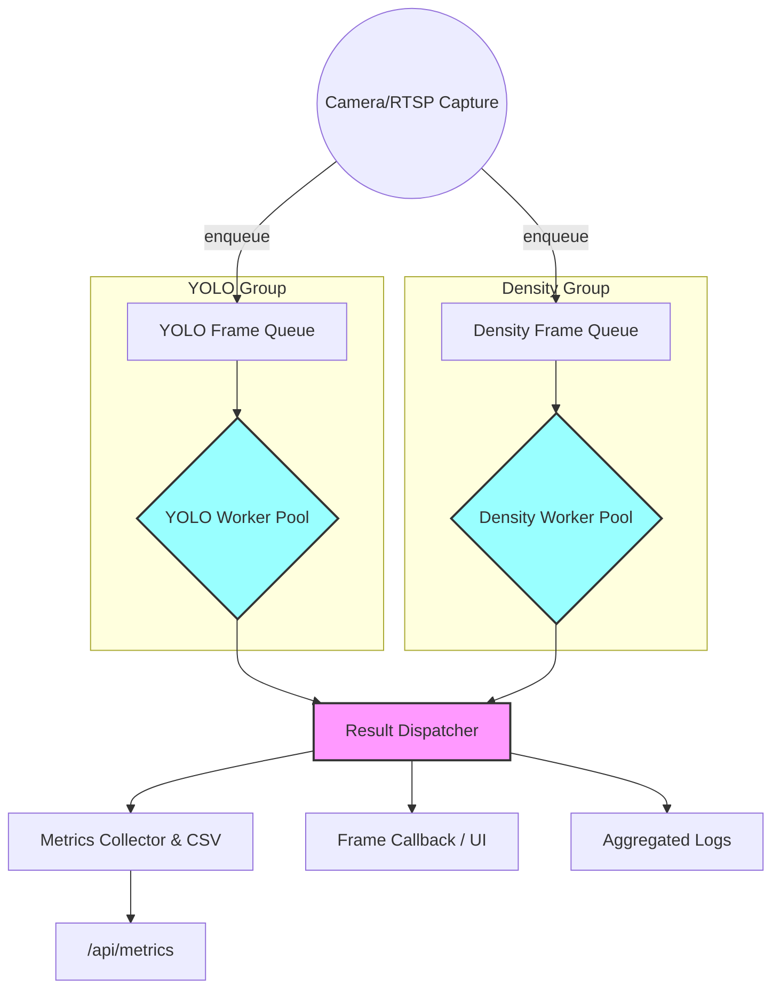

# Action Plan: Multi-Frame Inference Flow (EPIC)

## TL;DR
1. Keep `camera_app_pipeline.py` lean by offloading frame/task bookkeeping to scoped helpers.
2. Create separate worker groups (YOLO vs. density) with bounded queues, saturation tracking, and ordered dispatch.
3. Surface queue-depth metrics and warnings, ensuring UI/logs stay consistent while GPU stays busy.

## Architecture Overview

## Milestones

### Milestone 1 — Frame/Result Task Abstractions
- [x] Document responsibilities and expected flow (current plan serves as reference).
- [x] Create `frame_tasks.py` defining `FrameTask`, `ResultTask`, and helpers for tagging frames with IDs/timestamps.
- [x] Ensure tasks carry metadata for logging and queue-depth tracking.

### Milestone 2 — Worker Pool Infrastructure
- [ ] Introduce `worker_pool.py` to spawn thread pools per group, manage stop events, and emit saturation warnings when a queue hits capacity.
- [ ] Provide APIs to enqueue frames, dequeue results, and expose queue depths for metrics/logging.
- [ ] Validate that workers respect `configure_logger` settings and log through `logger.filtered_logger`.

### Milestone 3 — Capture Loop Overhaul in CameraAppPipeline
- [ ] Replace the `ModelThread` join-based loop with queue-backed capture/enqueue semantics using the new helpers.
- [ ] Start YOLO/density worker groups before entering `run()`, tag frames with incrementing IDs, and enqueue them per group.
- [ ] Drain the result queue each iteration, apply ordered dispatch (skip stale results), and keep the existing metrics/callback/log logic intact.
- [ ] Expose `yolo_queue_depth`/`density_queue_depth` in the metrics payload and log warnings when groups drop frames due to saturation.
- [ ] Gracefully shut down workers in the `finally` block.

### Milestone 4 — Density Pipeline Follow-up (future)
- [ ] Re-enable density processing (once YOLO concurrency is stable) with its own worker group and ordered processing path.
- [ ] Introduce optional UI indicators for per-group back-pressure using the new queue-depth metrics.

## Verification & Monitoring
- [ ] Run `./run_app.sh --profile rtx_extreme ...` and confirm GPU utilization/FPS gains; YOLO channel logs remain present when `YOLO_DEBUG_LOGS=1`.
- [ ] Inspect `/api/metrics` to ensure `frame_id`, `yolo_queue_depth`, and `density_queue_depth` behave monotonically and reflect load.
- [ ] Monitor console for saturation warnings when queues grow and validate UI always displays the next sequential frame/result.
- [ ] Optional: disable density to ensure YOLO queue saturation handling works independently.

## Notes
- Aim to keep `camera_app_pipeline.py` focused on orchestration; implement detailed logic in the new helper modules to avoid further bloat.
- Each milestone should conclude with a brief human-checkpoint (logs, metrics, or UI) before moving to the next.
