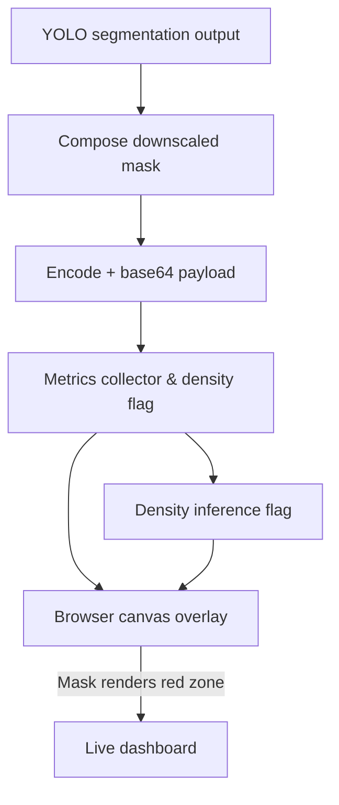

# Roadmap Update — Overlay mask & density status

## Current status
- `_compose_downscaled_mask` still drives mask generation, so we avoid materializing the full 4K RGBA before encoding.
- The metrics payload now includes `density_enabled`, the density timing breakdown, and the YOLO crop/fuse stats that the UI exposes.
- The browser resizes the mask canvas using the geometry metadata, ensuring the red tint follows the video frame without leaking into letterboxing.
- The mask overlay uses `globalAlpha`/`source-in` so it relies only on the binary mask and the `Hide mask overlay` toggle continues to function.
- Latest telemetry, mask timing instrumentation, and the new `README_PARAMETERS.md` are documented across the docs/plan set, keeping the mask story traceable.
- The performance/latency plan now describes the latency graph, log cleanup, and 25–30 fps target so the overlay timing story stays measurable.

## Diagram (current flow)

## Outstanding questions & next steps
1. Re-validate fuse timing under the current mask coverage to ensure the GPU render still averages ~15–20 ms per frame with the new downscaled flow.
2. Re-enable density processing once TensorRT/OpenVINO conversions are stable so the dashboard can show the `density status` toggle as "enabled" again.
3. Follow the performance/latency plan to add the future latency graph, console log cleanup, and 25–30 fps target so the overlay story is tied to measurable metrics.
