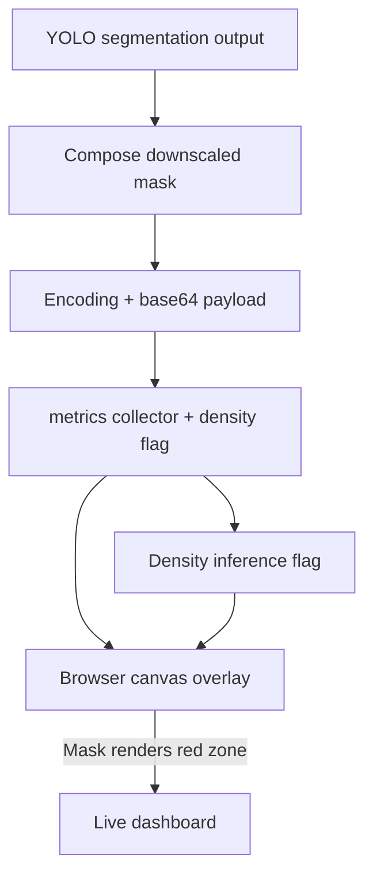

# Roadmap Update — Overlay mask + density status

## Current status
- Mask payloads are now generated by `_compose_downscaled_mask`, so we never materialize the full 4K bitmap before encoding.
- Metrics emit the `density_enabled` flag plus the `density` timing breakdowns and YOLO internal crop/fuse stats that you asked to surface in the UI.
- The web dashboard draws the mask canvas with `globalAlpha`/`source-in` so it now relies purely on the binary mask image; the `Hide mask overlay` toggle still works as before.

## Diagram (where we stand)

## Outstanding questions & next steps
1. Determine why the downscaled mask still reports full-frame coverage even though the detection count is 1; use the new `mask_small` debug log to see how much of the mask is nonzero.
2. Once we confirm the mask isn’t accidentally filling the entire buffer, revisit the fuse step to understand why it still spends ~20 ms.
3. Re-enable density processing once the TensorRT conversion is fixed so the dashboard can flip `density status` back to "enabled".
4. Collect any missing UI metrics you’d like to surface in a follow-up ticket.
