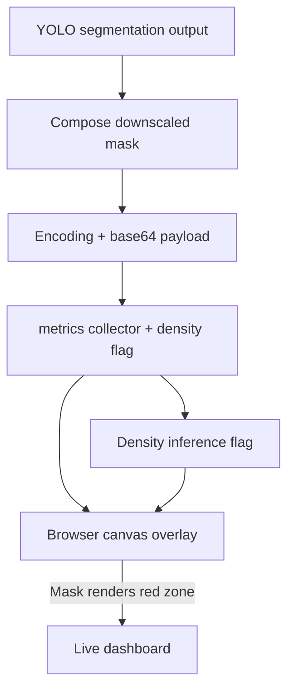

# Roadmap Update — Overlay mask + density status

## Current status
- Mask payloads are now generated by `_compose_downscaled_mask`, so we never materialize the full 4K bitmap before encoding.
- Metrics emit the `density_enabled` flag plus the `density` timing breakdowns and YOLO internal crop/fuse stats that you asked to surface in the UI.
- The overlay now respects the downscaled mask geometry metadata when sizing/positioning the canvas, so the red tint only covers the visible video and no longer bleeds into the letterboxed bars.
- The web dashboard draws the mask canvas with `globalAlpha`/`source-in` so it now relies purely on the binary mask image; the `Hide mask overlay` toggle still works as before.

## Diagram (where we stand)

## Outstanding questions & next steps
1. Validate fuse timing again while watching the mask coverage logs—mask area is now under control, so focus on whether GPU fuse still averages ~15–20 ms per frame.
3. Re-enable density processing once the TensorRT conversion is fixed so the dashboard can flip `density status` back to "enabled".
4. Collect any missing UI metrics you’d like to surface in a follow-up ticket.
